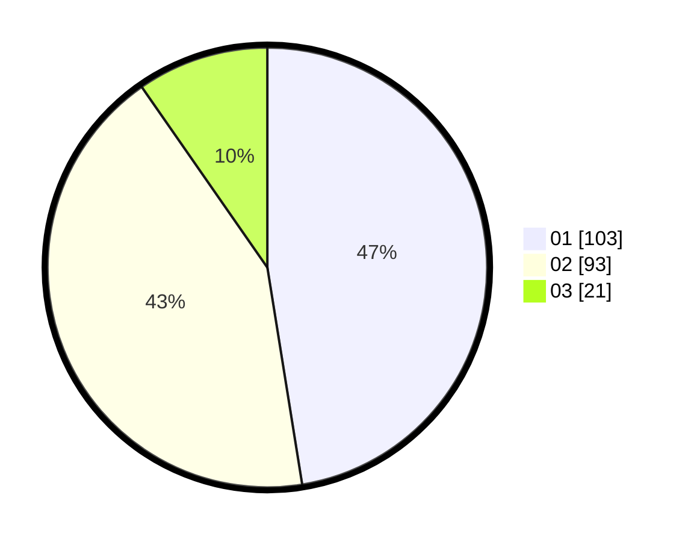

# Hasil

Hasil perolehan suara paslon dapat dilihat pada file paslon-01.txt, paslon-02.txt, dan paslon-03.txt.

Jika tidak ada, artinya data tersebut belum ada pada SIREKAP.

## Perolehan Suara

 * Paslon 01: **103**.
 * Paslon 02: **93**.
 * Paslon 03: **21**.

## Foto C Plano

https://sirekap-obj-formc.kpu.go.id/552e/pemilu/ppwp/31/72/04/10/07/3172041007082-20240214-185743--dbb40fda-5a26-4997-a8c0-b7e331607cd7.jpg

https://sirekap-obj-formc.kpu.go.id/552e/pemilu/ppwp/31/72/04/10/07/3172041007082-20240214-185745--dc1906da-509a-486d-9946-d322931802a0.jpg

https://sirekap-obj-formc.kpu.go.id/552e/pemilu/ppwp/31/72/04/10/07/3172041007082-20240214-185748--9f7fc1e0-cb0b-4a84-9197-b45e2f1bbd98.jpg

## DATA PEMILIH TETAP

Jumlah pemilih dalam DPT: **298**.
 * L: **145**.
 * P: **153**.

## DATA PENGGUNA HAK PILIH

Jumlah pengguna hak pilih dalam DPT: **222**.
 * L: **110**.
 * P: **112**.

Jumlah pengguna hak pilih dalam DPTb: **1**.
 * L: **1**.
 * P: **0**.

Jumlah pengguna hak pilih dalam DPK: **0**.
 * L: **0**.
 * P: **0**.

Jumlah pengguna hak pilih: **223**.
 * L: **111**.
 * P: **112**.

## JUMLAH SUARA SAH DAN TIDAK SAH

JUMLAH SELURUH SUARA SAH: **217**.

JUMLAH SUARA TIDAK SAH: **6**.

JUMLAH SELURUH SUARA SAH DAN SUARA TIDAK SAH: **223**.
