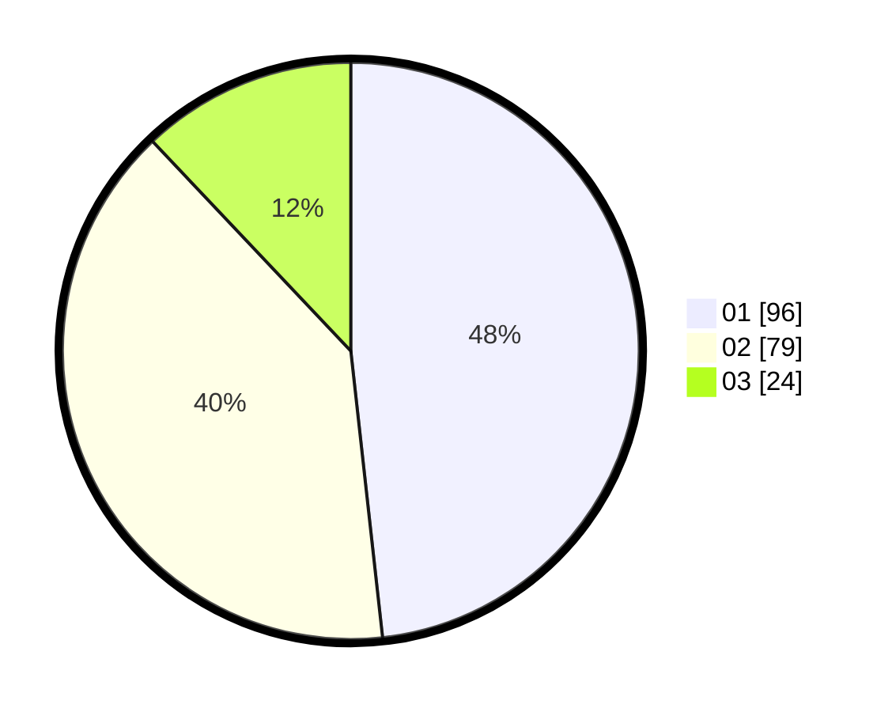

# Hasil

Hasil perolehan suara paslon dapat dilihat pada file paslon-01.txt, paslon-02.txt, dan paslon-03.txt.

Jika tidak ada, artinya data tersebut belum ada pada SIREKAP.

## Perolehan Suara

 * Paslon 01: **96**.
 * Paslon 02: **79**.
 * Paslon 03: **24**.

## Foto C Plano

https://sirekap-obj-formc.kpu.go.id/f891/pemilu/ppwp/31/72/04/10/07/3172041007089-20240214-155440--4d276905-ceec-4485-8b30-a8ecbe71ce38.jpg

https://sirekap-obj-formc.kpu.go.id/f891/pemilu/ppwp/31/72/04/10/07/3172041007089-20240214-155017--779efc3f-6d3c-40a4-8626-9c7c256802d3.jpg

https://sirekap-obj-formc.kpu.go.id/f891/pemilu/ppwp/31/72/04/10/07/3172041007089-20240214-155131--1fd38acf-863a-4bdf-8223-91d2a5815d82.jpg

## DATA PEMILIH TETAP

Jumlah pemilih dalam DPT: **288**.
 * L: **145**.
 * P: **143**.

## DATA PENGGUNA HAK PILIH

Jumlah pengguna hak pilih dalam DPT: **201**.
 * L: **94**.
 * P: **107**.

Jumlah pengguna hak pilih dalam DPTb: **0**.
 * L: **0**.
 * P: **0**.

Jumlah pengguna hak pilih dalam DPK: **0**.
 * L: **0**.
 * P: **0**.

Jumlah pengguna hak pilih: **201**.
 * L: **94**.
 * P: **107**.

## JUMLAH SUARA SAH DAN TIDAK SAH

JUMLAH SELURUH SUARA SAH: **199**.

JUMLAH SUARA TIDAK SAH: **2**.

JUMLAH SELURUH SUARA SAH DAN SUARA TIDAK SAH: **201**.
