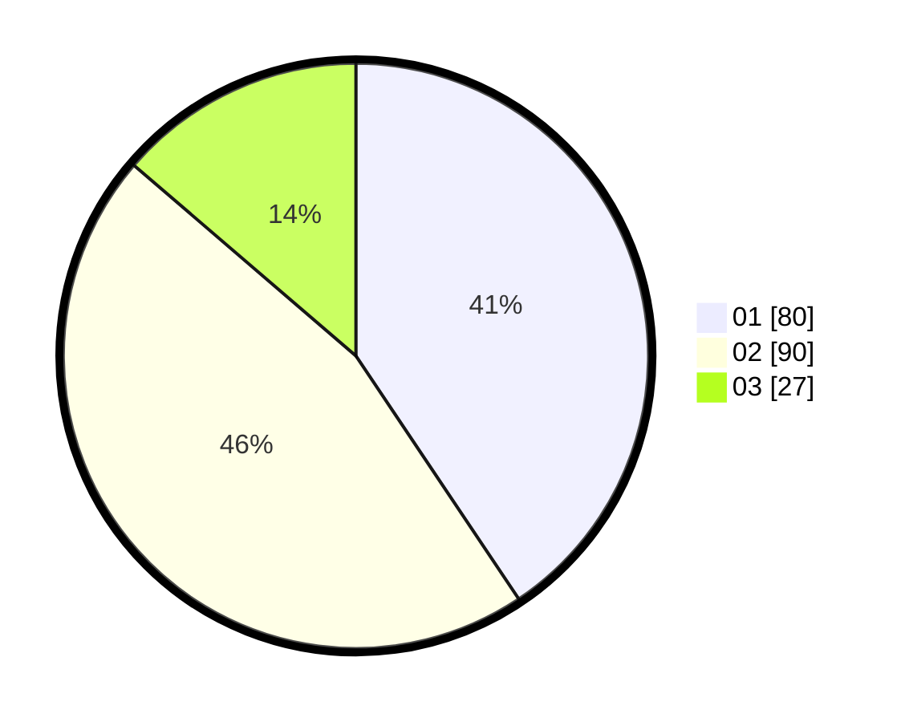

# Hasil

Hasil perolehan suara paslon dapat dilihat pada file paslon-01.txt, paslon-02.txt, dan paslon-03.txt.

Jika tidak ada, artinya data tersebut belum ada pada SIREKAP.

## Perolehan Suara

 * Paslon 01: **80**.
 * Paslon 02: **90**.
 * Paslon 03: **27**.

## Foto C Plano

https://sirekap-obj-formc.kpu.go.id/56c7/pemilu/ppwp/31/72/04/10/07/3172041007093-20240214-184811--4af9dd6f-1645-42f6-ab51-7927bbab3eda.jpg

https://sirekap-obj-formc.kpu.go.id/56c7/pemilu/ppwp/31/72/04/10/07/3172041007093-20240214-184828--d0a36289-1e07-48af-85e4-142afcd36282.jpg

https://sirekap-obj-formc.kpu.go.id/56c7/pemilu/ppwp/31/72/04/10/07/3172041007093-20240214-184831--faf9e778-070a-4e0c-8bce-03c3a987f3c1.jpg

## DATA PEMILIH TETAP

Jumlah pemilih dalam DPT: **287**.
 * L: **144**.
 * P: **143**.

## DATA PENGGUNA HAK PILIH

Jumlah pengguna hak pilih dalam DPT: **200**.
 * L: **93**.
 * P: **107**.

Jumlah pengguna hak pilih dalam DPTb: **0**.
 * L: **0**.
 * P: **0**.

Jumlah pengguna hak pilih dalam DPK: **2**.
 * L: **1**.
 * P: **1**.

Jumlah pengguna hak pilih: **202**.
 * L: **94**.
 * P: **108**.

## JUMLAH SUARA SAH DAN TIDAK SAH

JUMLAH SELURUH SUARA SAH: **197**.

JUMLAH SUARA TIDAK SAH: **5**.

JUMLAH SELURUH SUARA SAH DAN SUARA TIDAK SAH: **202**.
