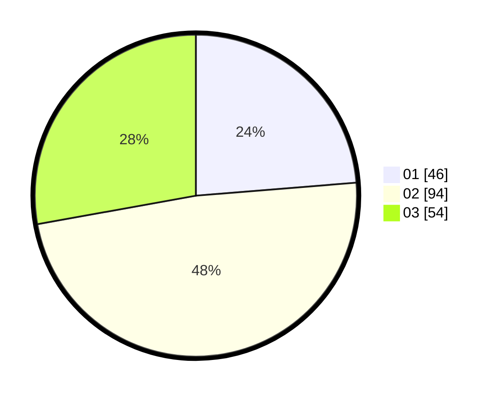

# Hasil

Hasil perolehan suara paslon dapat dilihat pada file paslon-01.txt, paslon-02.txt, dan paslon-03.txt.

Jika tidak ada, artinya data tersebut belum ada pada SIREKAP.

## Perolehan Suara

 * Paslon 01: **46**.
 * Paslon 02: **94**.
 * Paslon 03: **54**.

## Foto C Plano

https://sirekap-obj-formc.kpu.go.id/b03e/pemilu/ppwp/31/72/04/10/07/3172041007096-20240214-175442--8dbd821e-092f-4c2f-b629-017ae385a370.jpg

https://sirekap-obj-formc.kpu.go.id/b03e/pemilu/ppwp/31/72/04/10/07/3172041007096-20240214-192208--171b729a-ca7e-436a-93e3-beb457690e80.jpg

https://sirekap-obj-formc.kpu.go.id/b03e/pemilu/ppwp/31/72/04/10/07/3172041007096-20240214-194037--2a9b079e-28f2-4722-b051-3818bdc8fcd0.jpg

## DATA PEMILIH TETAP

Jumlah pemilih dalam DPT: **289**.
 * L: **128**.
 * P: **161**.

## DATA PENGGUNA HAK PILIH

Jumlah pengguna hak pilih dalam DPT: **190**.
 * L: **79**.
 * P: **111**.

Jumlah pengguna hak pilih dalam DPTb: **4**.
 * L: **1**.
 * P: **3**.

Jumlah pengguna hak pilih dalam DPK: **2**.
 * L: **1**.
 * P: **1**.

Jumlah pengguna hak pilih: **196**.
 * L: **81**.
 * P: **115**.

## JUMLAH SUARA SAH DAN TIDAK SAH

JUMLAH SELURUH SUARA SAH: **194**.

JUMLAH SUARA TIDAK SAH: **2**.

JUMLAH SELURUH SUARA SAH DAN SUARA TIDAK SAH: **196**.
