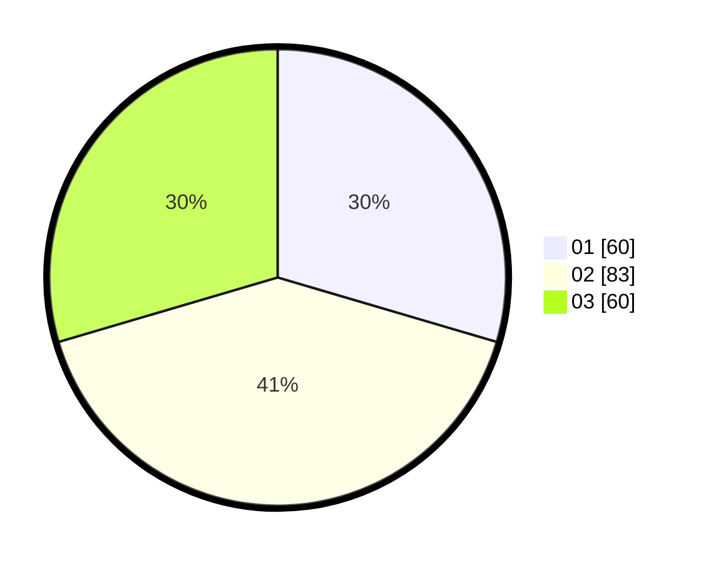

# Hasil

Hasil perolehan suara paslon dapat dilihat pada file paslon-01.txt, paslon-02.txt, dan paslon-03.txt.

Jika tidak ada, artinya data tersebut belum ada pada SIREKAP.

## Perolehan Suara

 * Paslon 01: **60**.
 * Paslon 02: **83**.
 * Paslon 03: **60**.

## Foto C Plano

https://sirekap-obj-formc.kpu.go.id/542d/pemilu/ppwp/31/72/04/10/07/3172041007098-20240215-045654--b663de80-cf37-4e0e-919b-97341f7ec4bd.jpg

https://sirekap-obj-formc.kpu.go.id/542d/pemilu/ppwp/31/72/04/10/07/3172041007098-20240214-155716--50ac0e80-0e66-43fe-a5aa-2f4ab0fb1d70.jpg

https://sirekap-obj-formc.kpu.go.id/542d/pemilu/ppwp/31/72/04/10/07/3172041007098-20240214-155523--2e5a3c15-dc08-4142-9599-e689b18a1eb5.jpg

## DATA PEMILIH TETAP

Jumlah pemilih dalam DPT: **288**.
 * L: **146**.
 * P: **142**.

## DATA PENGGUNA HAK PILIH

Jumlah pengguna hak pilih dalam DPT: **206**.
 * L: **97**.
 * P: **109**.

Jumlah pengguna hak pilih dalam DPTb: **0**.
 * L: **0**.
 * P: **0**.

Jumlah pengguna hak pilih dalam DPK: **0**.
 * L: **0**.
 * P: **0**.

Jumlah pengguna hak pilih: **206**.
 * L: **97**.
 * P: **109**.

## JUMLAH SUARA SAH DAN TIDAK SAH

JUMLAH SELURUH SUARA SAH: **203**.

JUMLAH SUARA TIDAK SAH: **3**.

JUMLAH SELURUH SUARA SAH DAN SUARA TIDAK SAH: **206**.
