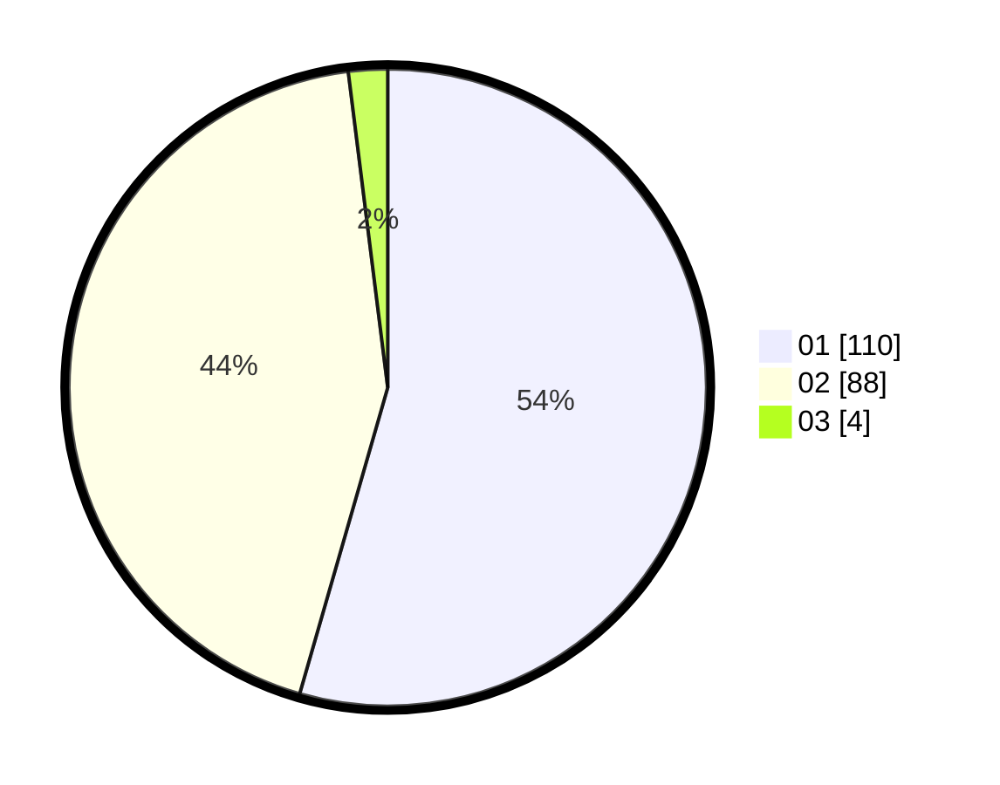

# Hasil

Hasil perolehan suara paslon dapat dilihat pada file paslon-01.txt, paslon-02.txt, dan paslon-03.txt.

Jika tidak ada, artinya data tersebut belum ada pada SIREKAP.

## Perolehan Suara

 * Paslon 01: **110**.
 * Paslon 02: **88**.
 * Paslon 03: **4**.

## Foto C Plano

https://sirekap-obj-formc.kpu.go.id/e049/pemilu/ppwp/31/72/04/10/07/3172041007106-20240214-193924--06e5c034-a9bd-4f4a-abc2-e01e9817826c.jpg

https://sirekap-obj-formc.kpu.go.id/e049/pemilu/ppwp/31/72/04/10/07/3172041007106-20240214-191958--bb9e1c51-8f9d-4412-bfdf-843dbabcdec4.jpg

https://sirekap-obj-formc.kpu.go.id/e049/pemilu/ppwp/31/72/04/10/07/3172041007106-20240214-192347--9521f93d-c7de-423d-b5e5-44837affd985.jpg

## DATA PEMILIH TETAP

Jumlah pemilih dalam DPT: **289**.
 * L: **146**.
 * P: **143**.

## DATA PENGGUNA HAK PILIH

Jumlah pengguna hak pilih dalam DPT: **207**.
 * L: **103**.
 * P: **104**.

Jumlah pengguna hak pilih dalam DPTb: **1**.
 * L: **1**.
 * P: **0**.

Jumlah pengguna hak pilih dalam DPK: **4**.
 * L: **3**.
 * P: **1**.

Jumlah pengguna hak pilih: **212**.
 * L: **107**.
 * P: **105**.

## JUMLAH SUARA SAH DAN TIDAK SAH

JUMLAH SELURUH SUARA SAH: **206**.

JUMLAH SUARA TIDAK SAH: **6**.

JUMLAH SELURUH SUARA SAH DAN SUARA TIDAK SAH: **212**.
