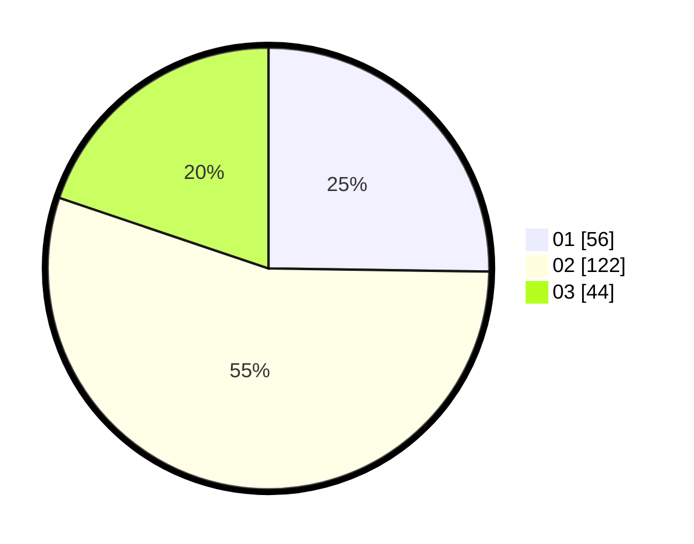

# Hasil

Hasil perolehan suara paslon dapat dilihat pada file paslon-01.txt, paslon-02.txt, dan paslon-03.txt.

Jika tidak ada, artinya data tersebut belum ada pada SIREKAP.

## Perolehan Suara

 * Paslon 01: **56**.
 * Paslon 02: **122**.
 * Paslon 03: **44**.

## Foto C Plano

https://sirekap-obj-formc.kpu.go.id/e5bb/pemilu/ppwp/31/72/04/10/07/3172041007111-20240214-211343--74a4c3c0-15c7-474f-8de2-b8cd67a563fb.jpg

https://sirekap-obj-formc.kpu.go.id/e5bb/pemilu/ppwp/31/72/04/10/07/3172041007111-20240214-211752--b584faa9-4fe8-4a86-8969-e37f9ed4b917.jpg

https://sirekap-obj-formc.kpu.go.id/e5bb/pemilu/ppwp/31/72/04/10/07/3172041007111-20240214-212154--84b3a2b6-f205-42b8-ae86-b168b9069491.jpg

## DATA PEMILIH TETAP

Jumlah pemilih dalam DPT: **290**.
 * L: **143**.
 * P: **147**.

## DATA PENGGUNA HAK PILIH

Jumlah pengguna hak pilih dalam DPT: **221**.
 * L: **104**.
 * P: **117**.

Jumlah pengguna hak pilih dalam DPTb: **0**.
 * L: **0**.
 * P: **0**.

Jumlah pengguna hak pilih dalam DPK: **1**.
 * L: **1**.
 * P: **0**.

Jumlah pengguna hak pilih: **222**.
 * L: **105**.
 * P: **117**.

## JUMLAH SUARA SAH DAN TIDAK SAH

JUMLAH SELURUH SUARA SAH: **222**.

JUMLAH SUARA TIDAK SAH: **0**.

JUMLAH SELURUH SUARA SAH DAN SUARA TIDAK SAH: **222**.
