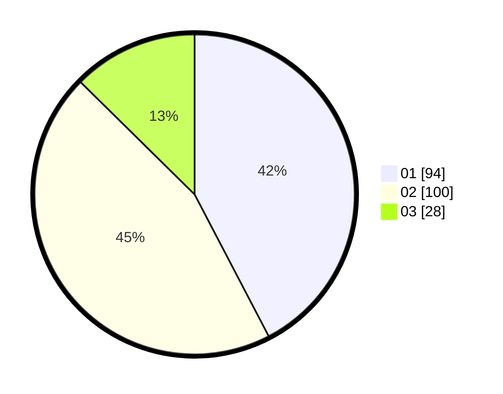

# Hasil

Hasil perolehan suara paslon dapat dilihat pada file paslon-01.txt, paslon-02.txt, dan paslon-03.txt.

Jika tidak ada, artinya data tersebut belum ada pada SIREKAP.

## Perolehan Suara

 * Paslon 01: **94**.
 * Paslon 02: **100**.
 * Paslon 03: **28**.

## Foto C Plano

https://sirekap-obj-formc.kpu.go.id/3a1d/pemilu/ppwp/31/72/04/10/07/3172041007114-20240214-213007--b7123e1a-2ba1-4abc-82d8-959b9e24eccb.jpg

https://sirekap-obj-formc.kpu.go.id/3a1d/pemilu/ppwp/31/72/04/10/07/3172041007114-20240214-213012--bd6d7ce8-057f-4431-9c3f-bc38e96c7247.jpg

https://sirekap-obj-formc.kpu.go.id/3a1d/pemilu/ppwp/31/72/04/10/07/3172041007114-20240214-213015--cd55855f-8085-4896-ac27-44284ed94cb8.jpg

## DATA PEMILIH TETAP

Jumlah pemilih dalam DPT: **289**.
 * L: **138**.
 * P: **151**.

## DATA PENGGUNA HAK PILIH

Jumlah pengguna hak pilih dalam DPT: **228**.
 * L: **114**.
 * P: **114**.

Jumlah pengguna hak pilih dalam DPTb: **0**.
 * L: **0**.
 * P: **0**.

Jumlah pengguna hak pilih dalam DPK: **0**.
 * L: **0**.
 * P: **0**.

Jumlah pengguna hak pilih: **228**.
 * L: **114**.
 * P: **114**.

## JUMLAH SUARA SAH DAN TIDAK SAH

JUMLAH SELURUH SUARA SAH: **222**.

JUMLAH SUARA TIDAK SAH: **6**.

JUMLAH SELURUH SUARA SAH DAN SUARA TIDAK SAH: **228**.
