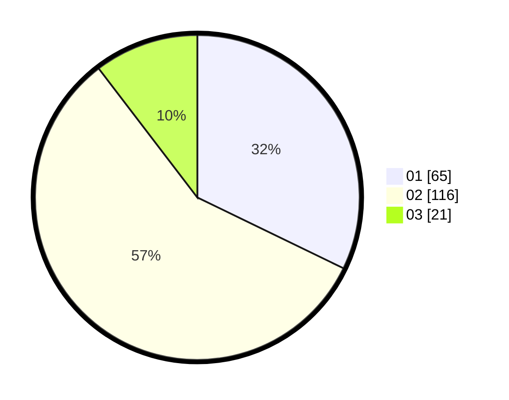

# Hasil

Hasil perolehan suara paslon dapat dilihat pada file paslon-01.txt, paslon-02.txt, dan paslon-03.txt.

Jika tidak ada, artinya data tersebut belum ada pada SIREKAP.

## Perolehan Suara

 * Paslon 01: **65**.
 * Paslon 02: **116**.
 * Paslon 03: **21**.

## Foto C Plano

https://sirekap-obj-formc.kpu.go.id/dd96/pemilu/ppwp/31/72/04/10/07/3172041007123-20240215-010930--cef914f1-f0bf-449b-aa45-aa3bcf533219.jpg

https://sirekap-obj-formc.kpu.go.id/dd96/pemilu/ppwp/31/72/04/10/07/3172041007123-20240215-011020--627578e1-088c-4406-8360-f2eaa49f290a.jpg

https://sirekap-obj-formc.kpu.go.id/dd96/pemilu/ppwp/31/72/04/10/07/3172041007123-20240215-011110--059fb06c-ce9f-4b23-9568-64e9d5ef2d13.jpg
