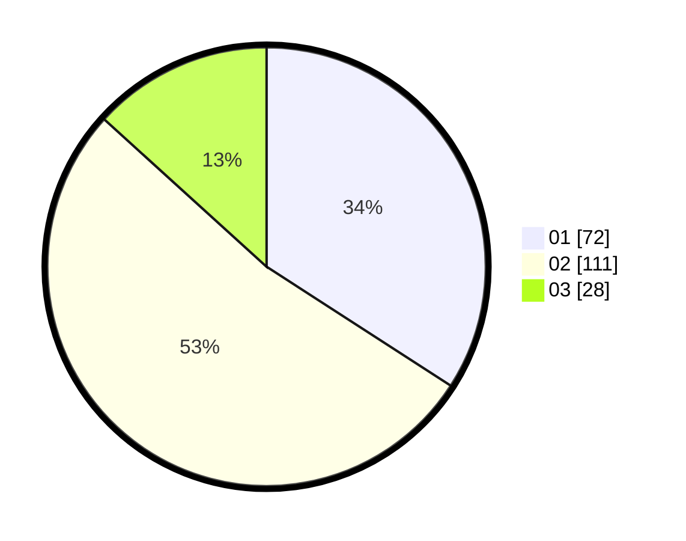

# Hasil

Hasil perolehan suara paslon dapat dilihat pada file paslon-01.txt, paslon-02.txt, dan paslon-03.txt.

Jika tidak ada, artinya data tersebut belum ada pada SIREKAP.

## Perolehan Suara

 * Paslon 01: **72**.
 * Paslon 02: **111**.
 * Paslon 03: **28**.

## Foto C Plano

https://sirekap-obj-formc.kpu.go.id/2a35/pemilu/ppwp/31/72/04/10/07/3172041007139-20240214-191706--95cf0cb8-ad87-4380-9c7f-20cfe65eb2f1.jpg

https://sirekap-obj-formc.kpu.go.id/2a35/pemilu/ppwp/31/72/04/10/07/3172041007139-20240214-191708--cd83ec9c-03e7-4b92-a0a3-01ecfc282143.jpg

https://sirekap-obj-formc.kpu.go.id/2a35/pemilu/ppwp/31/72/04/10/07/3172041007139-20240214-191711--f205c319-76f0-4254-bd46-0d3196c210da.jpg

## DATA PEMILIH TETAP

Jumlah pemilih dalam DPT: **288**.
 * L: **136**.
 * P: **152**.

## DATA PENGGUNA HAK PILIH

Jumlah pengguna hak pilih dalam DPT: **208**.
 * L: **97**.
 * P: **111**.

Jumlah pengguna hak pilih dalam DPTb: **0**.
 * L: **0**.
 * P: **0**.

Jumlah pengguna hak pilih dalam DPK: **5**.
 * L: **3**.
 * P: **2**.

Jumlah pengguna hak pilih: **213**.
 * L: **100**.
 * P: **113**.

## JUMLAH SUARA SAH DAN TIDAK SAH

JUMLAH SELURUH SUARA SAH: **211**.

JUMLAH SUARA TIDAK SAH: **2**.

JUMLAH SELURUH SUARA SAH DAN SUARA TIDAK SAH: **213**.
