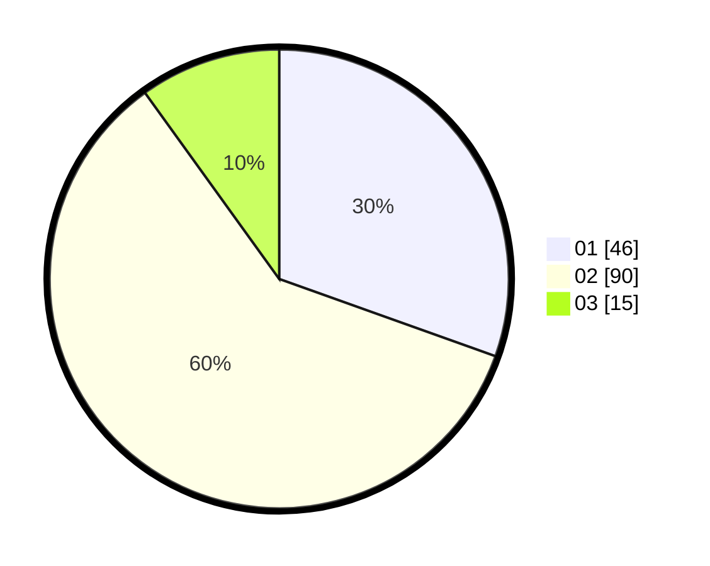

# Hasil

Hasil perolehan suara paslon dapat dilihat pada file paslon-01.txt, paslon-02.txt, dan paslon-03.txt.

Jika tidak ada, artinya data tersebut belum ada pada SIREKAP.

## Perolehan Suara

 * Paslon 01: **46**.
 * Paslon 02: **90**.
 * Paslon 03: **15**.

## Foto C Plano

https://sirekap-obj-formc.kpu.go.id/3eef/pemilu/ppwp/31/72/04/10/07/3172041007143-20240214-141431--18e63a33-4c72-41f3-a822-fb2946c09ac0.jpg

https://sirekap-obj-formc.kpu.go.id/3eef/pemilu/ppwp/31/72/04/10/07/3172041007143-20240214-141601--7c7becad-1bb1-4148-99d1-4e97743ff64e.jpg

https://sirekap-obj-formc.kpu.go.id/3eef/pemilu/ppwp/31/72/04/10/07/3172041007143-20240214-195022--d1c39129-7788-434d-9bed-5109c017f57f.jpg

## DATA PEMILIH TETAP

Jumlah pemilih dalam DPT: **217**.
 * L: **102**.
 * P: **711**.

## DATA PENGGUNA HAK PILIH

Jumlah pengguna hak pilih dalam DPT: **153**.
 * L: **81**.
 * P: **72**.

Jumlah pengguna hak pilih dalam DPTb: **1**.
 * L: **0**.
 * P: **1**.

Jumlah pengguna hak pilih dalam DPK: **0**.
 * L: **0**.
 * P: **0**.

Jumlah pengguna hak pilih: **154**.
 * L: **81**.
 * P: **73**.

## JUMLAH SUARA SAH DAN TIDAK SAH

JUMLAH SELURUH SUARA SAH: **151**.

JUMLAH SUARA TIDAK SAH: **3**.

JUMLAH SELURUH SUARA SAH DAN SUARA TIDAK SAH: **154**.
