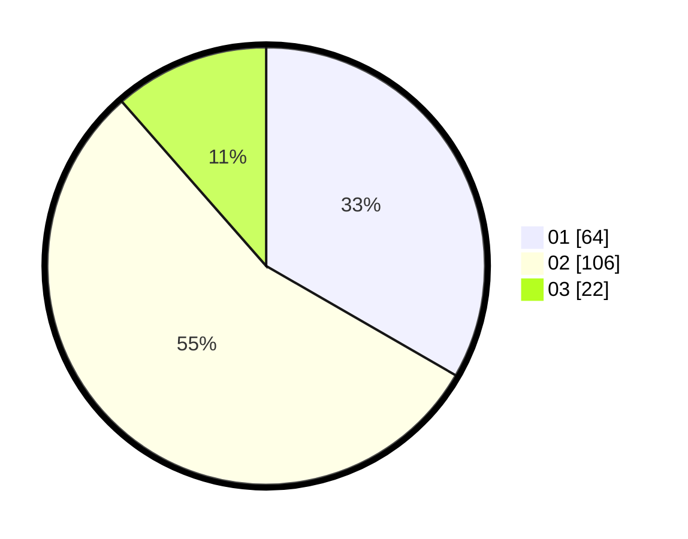

# Hasil

Hasil perolehan suara paslon dapat dilihat pada file paslon-01.txt, paslon-02.txt, dan paslon-03.txt.

Jika tidak ada, artinya data tersebut belum ada pada SIREKAP.

## Perolehan Suara

 * Paslon 01: **64**.
 * Paslon 02: **106**.
 * Paslon 03: **22**.

## Foto C Plano

https://sirekap-obj-formc.kpu.go.id/6eed/pemilu/ppwp/31/72/04/10/07/3172041007152-20240214-205248--4fc0cc27-deab-4e96-bbc8-4290cfd52ed4.jpg

https://sirekap-obj-formc.kpu.go.id/6eed/pemilu/ppwp/31/72/04/10/07/3172041007152-20240214-205442--efb52c41-0bb2-472a-a21a-3a68eedcb7e7.jpg

https://sirekap-obj-formc.kpu.go.id/6eed/pemilu/ppwp/31/72/04/10/07/3172041007152-20240214-205707--992fba11-bc5a-469c-8d44-e09221c028f2.jpg

## DATA PEMILIH TETAP

Jumlah pemilih dalam DPT: **285**.
 * L: **147**.
 * P: **138**.

## DATA PENGGUNA HAK PILIH

Jumlah pengguna hak pilih dalam DPT: **191**.
 * L: **91**.
 * P: **100**.

Jumlah pengguna hak pilih dalam DPTb: **2**.
 * L: **0**.
 * P: **2**.

Jumlah pengguna hak pilih dalam DPK: **0**.
 * L: **0**.
 * P: **0**.

Jumlah pengguna hak pilih: **193**.
 * L: **91**.
 * P: **102**.

## JUMLAH SUARA SAH DAN TIDAK SAH

JUMLAH SELURUH SUARA SAH: **192**.

JUMLAH SUARA TIDAK SAH: **1**.

JUMLAH SELURUH SUARA SAH DAN SUARA TIDAK SAH: **193**.
