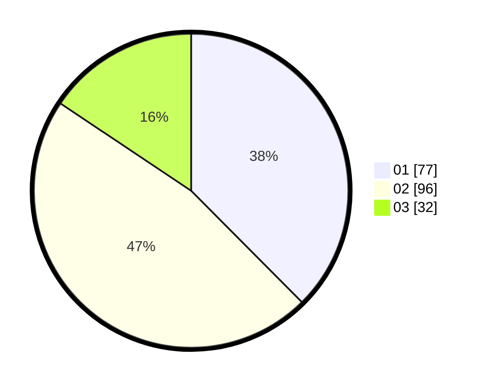

# Hasil

Hasil perolehan suara paslon dapat dilihat pada file paslon-01.txt, paslon-02.txt, dan paslon-03.txt.

Jika tidak ada, artinya data tersebut belum ada pada SIREKAP.

## Perolehan Suara

 * Paslon 01: **77**.
 * Paslon 02: **96**.
 * Paslon 03: **32**.

## Foto C Plano

https://sirekap-obj-formc.kpu.go.id/5383/pemilu/ppwp/31/72/04/10/07/3172041007159-20240214-155658--9917e1ce-0a00-4c86-9277-31dafe50110e.jpg

https://sirekap-obj-formc.kpu.go.id/5383/pemilu/ppwp/31/72/04/10/07/3172041007159-20240215-162707--c3762c6c-0956-4e54-a28f-e624f700f05d.jpg

https://sirekap-obj-formc.kpu.go.id/5383/pemilu/ppwp/31/72/04/10/07/3172041007159-20240214-155753--61f24d23-110d-403b-bca5-03cf8d4a2768.jpg

## DATA PEMILIH TETAP

Jumlah pemilih dalam DPT: **279**.
 * L: **137**.
 * P: **142**.

## DATA PENGGUNA HAK PILIH

Jumlah pengguna hak pilih dalam DPT: **206**.
 * L: **94**.
 * P: **112**.

Jumlah pengguna hak pilih dalam DPTb: **6**.
 * L: **3**.
 * P: **3**.

Jumlah pengguna hak pilih dalam DPK: **0**.
 * L: **0**.
 * P: **0**.

Jumlah pengguna hak pilih: **212**.
 * L: **97**.
 * P: **115**.

## JUMLAH SUARA SAH DAN TIDAK SAH

JUMLAH SELURUH SUARA SAH: **205**.

JUMLAH SUARA TIDAK SAH: **7**.

JUMLAH SELURUH SUARA SAH DAN SUARA TIDAK SAH: **212**.
