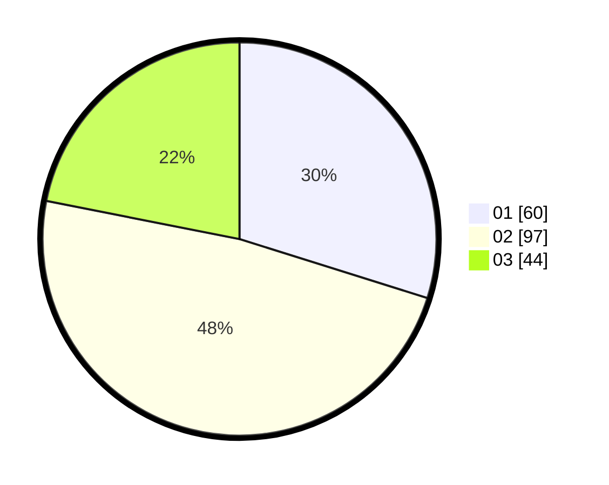

# Hasil

Hasil perolehan suara paslon dapat dilihat pada file paslon-01.txt, paslon-02.txt, dan paslon-03.txt.

Jika tidak ada, artinya data tersebut belum ada pada SIREKAP.

## Perolehan Suara

 * Paslon 01: **60**.
 * Paslon 02: **97**.
 * Paslon 03: **44**.

## Foto C Plano

https://sirekap-obj-formc.kpu.go.id/3474/pemilu/ppwp/31/72/04/10/07/3172041007161-20240214-214441--cf96c9f6-5450-4e30-b41d-99962f5d76f3.jpg

https://sirekap-obj-formc.kpu.go.id/3474/pemilu/ppwp/31/72/04/10/07/3172041007161-20240214-155905--b9b2f7b2-dbc4-4163-b6a1-dc053d7870e9.jpg

https://sirekap-obj-formc.kpu.go.id/3474/pemilu/ppwp/31/72/04/10/07/3172041007161-20240214-184521--1de06068-4add-48ef-8d92-ad78999a2e3d.jpg
