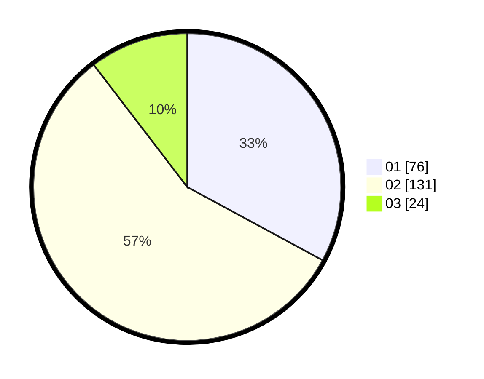

# Hasil

Hasil perolehan suara paslon dapat dilihat pada file paslon-01.txt, paslon-02.txt, dan paslon-03.txt.

Jika tidak ada, artinya data tersebut belum ada pada SIREKAP.

## Perolehan Suara

 * Paslon 01: **76**.
 * Paslon 02: **131**.
 * Paslon 03: **24**.

## Foto C Plano

https://sirekap-obj-formc.kpu.go.id/1b8b/pemilu/ppwp/31/72/04/10/07/3172041007162-20240214-201008--3cfe091c-c741-4ef2-a087-628620631aa0.jpg

https://sirekap-obj-formc.kpu.go.id/1b8b/pemilu/ppwp/31/72/04/10/07/3172041007162-20240214-203352--d5e8badb-9421-49b7-88f7-4f20fe0ef25d.jpg

https://sirekap-obj-formc.kpu.go.id/1b8b/pemilu/ppwp/31/72/04/10/07/3172041007162-20240214-201432--fdd8b9ab-5fe2-402d-99e3-4eb9018895cf.jpg

## DATA PEMILIH TETAP

Jumlah pemilih dalam DPT: **288**.
 * L: **139**.
 * P: **149**.

## DATA PENGGUNA HAK PILIH

Jumlah pengguna hak pilih dalam DPT: **231**.
 * L: **106**.
 * P: **125**.

Jumlah pengguna hak pilih dalam DPTb: **1**.
 * L: **1**.
 * P: **0**.

Jumlah pengguna hak pilih dalam DPK: **4**.
 * L: **1**.
 * P: **3**.

Jumlah pengguna hak pilih: **236**.
 * L: **108**.
 * P: **128**.

## JUMLAH SUARA SAH DAN TIDAK SAH

JUMLAH SELURUH SUARA SAH: **231**.

JUMLAH SUARA TIDAK SAH: **5**.

JUMLAH SELURUH SUARA SAH DAN SUARA TIDAK SAH: **236**.
