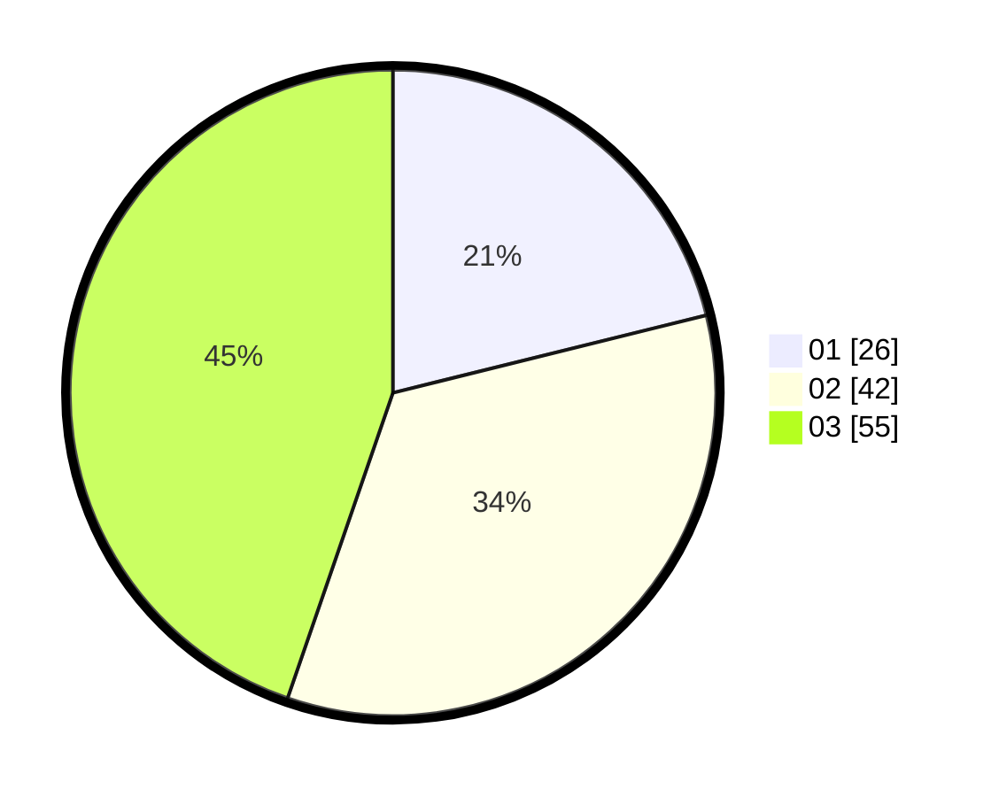

# Hasil

Hasil perolehan suara paslon dapat dilihat pada file paslon-01.txt, paslon-02.txt, dan paslon-03.txt.

Jika tidak ada, artinya data tersebut belum ada pada SIREKAP.

## Perolehan Suara

 * Paslon 01: **26**.
 * Paslon 02: **42**.
 * Paslon 03: **55**.

## Foto C Plano

https://sirekap-obj-formc.kpu.go.id/8bb2/pemilu/ppwp/31/72/04/10/07/3172041007167-20240214-210109--5f2ddb4f-911a-4ba8-936c-4bb859e9c8fe.jpg

https://sirekap-obj-formc.kpu.go.id/8bb2/pemilu/ppwp/31/72/04/10/07/3172041007167-20240214-210223--5840438e-ff6f-4fc5-8cec-625c28d09e98.jpg

https://sirekap-obj-formc.kpu.go.id/8bb2/pemilu/ppwp/31/72/04/10/07/3172041007167-20240214-233750--001bd17e-da8d-4f8e-b2b4-7fad2669e815.jpg

## DATA PEMILIH TETAP

Jumlah pemilih dalam DPT: **252**.
 * L: **130**.
 * P: **122**.

## DATA PENGGUNA HAK PILIH

Jumlah pengguna hak pilih dalam DPT: **170**.
 * L: **79**.
 * P: **91**.

Jumlah pengguna hak pilih dalam DPTb: **0**.
 * L: **0**.
 * P: **0**.

Jumlah pengguna hak pilih dalam DPK: **4**.
 * L: **1**.
 * P: **3**.

Jumlah pengguna hak pilih: **174**.
 * L: **80**.
 * P: **94**.

## JUMLAH SUARA SAH DAN TIDAK SAH

JUMLAH SELURUH SUARA SAH: **173**.

JUMLAH SUARA TIDAK SAH: **1**.

JUMLAH SELURUH SUARA SAH DAN SUARA TIDAK SAH: **174**.
