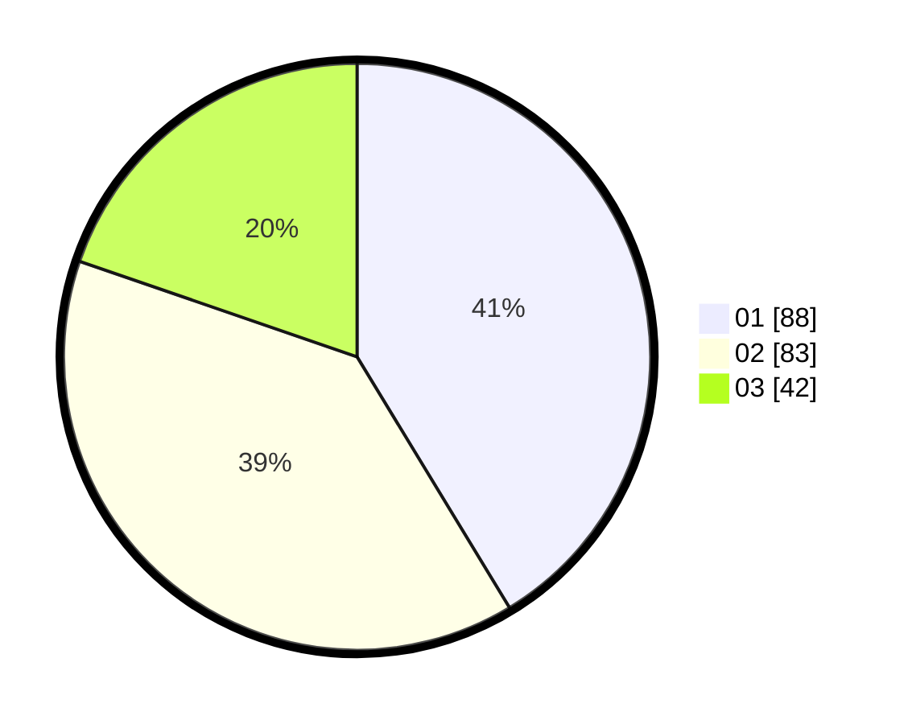

# Hasil

Hasil perolehan suara paslon dapat dilihat pada file paslon-01.txt, paslon-02.txt, dan paslon-03.txt.

Jika tidak ada, artinya data tersebut belum ada pada SIREKAP.

## Perolehan Suara

 * Paslon 01: **88**.
 * Paslon 02: **83**.
 * Paslon 03: **42**.

## Foto C Plano

https://sirekap-obj-formc.kpu.go.id/e72b/pemilu/ppwp/31/72/04/10/07/3172041007170-20240214-193246--f73e9e4a-6d07-4541-bc22-1a2a50562a4b.jpg

https://sirekap-obj-formc.kpu.go.id/e72b/pemilu/ppwp/31/72/04/10/07/3172041007170-20240214-193404--130c1799-f379-4eae-be45-43d4bbb4d2f1.jpg

https://sirekap-obj-formc.kpu.go.id/e72b/pemilu/ppwp/31/72/04/10/07/3172041007170-20240214-193516--3d45a65c-6468-4e48-a768-2592d25558a9.jpg

## DATA PEMILIH TETAP

Jumlah pemilih dalam DPT: **265**.
 * L: **113**.
 * P: **152**.

## DATA PENGGUNA HAK PILIH

Jumlah pengguna hak pilih dalam DPT: **206**.
 * L: **83**.
 * P: **123**.

Jumlah pengguna hak pilih dalam DPTb: **3**.
 * L: **1**.
 * P: **2**.

Jumlah pengguna hak pilih dalam DPK: **6**.
 * L: **1**.
 * P: **5**.

Jumlah pengguna hak pilih: **215**.
 * L: **85**.
 * P: **130**.

## JUMLAH SUARA SAH DAN TIDAK SAH

JUMLAH SELURUH SUARA SAH: **213**.

JUMLAH SUARA TIDAK SAH: **2**.

JUMLAH SELURUH SUARA SAH DAN SUARA TIDAK SAH: **215**.
