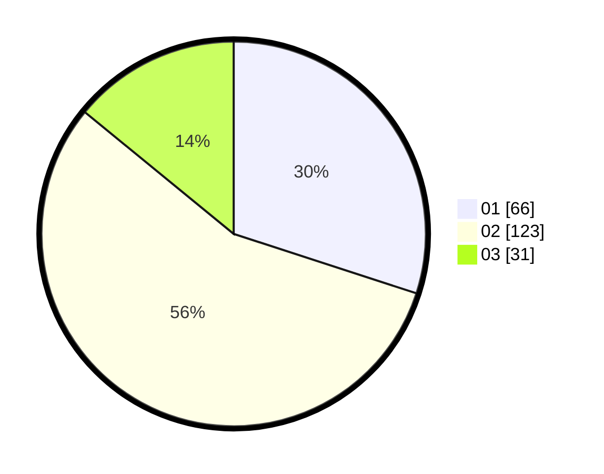

# Hasil

Hasil perolehan suara paslon dapat dilihat pada file paslon-01.txt, paslon-02.txt, dan paslon-03.txt.

Jika tidak ada, artinya data tersebut belum ada pada SIREKAP.

## Perolehan Suara

 * Paslon 01: **66**.
 * Paslon 02: **123**.
 * Paslon 03: **31**.

## Foto C Plano

https://sirekap-obj-formc.kpu.go.id/b7ee/pemilu/ppwp/31/72/04/10/07/3172041007176-20240214-193320--a8eee308-7f9d-430f-8468-9c37da6d349e.jpg

https://sirekap-obj-formc.kpu.go.id/b7ee/pemilu/ppwp/31/72/04/10/07/3172041007176-20240214-193400--8a21da92-c99c-4b41-9602-8fc9a28caa1a.jpg

https://sirekap-obj-formc.kpu.go.id/b7ee/pemilu/ppwp/31/72/04/10/07/3172041007176-20240214-193509--b0380603-f7ac-49e0-8d78-59448115a7c3.jpg

## DATA PEMILIH TETAP

Jumlah pemilih dalam DPT: **294**.
 * L: **141**.
 * P: **153**.

## DATA PENGGUNA HAK PILIH

Jumlah pengguna hak pilih dalam DPT: **219**.
 * L: **99**.
 * P: **120**.

Jumlah pengguna hak pilih dalam DPTb: **2**.
 * L: **1**.
 * P: **1**.

Jumlah pengguna hak pilih dalam DPK: **1**.
 * L: **0**.
 * P: **1**.

Jumlah pengguna hak pilih: **222**.
 * L: **100**.
 * P: **122**.

## JUMLAH SUARA SAH DAN TIDAK SAH

JUMLAH SELURUH SUARA SAH: **220**.

JUMLAH SUARA TIDAK SAH: **2**.

JUMLAH SELURUH SUARA SAH DAN SUARA TIDAK SAH: **222**.
