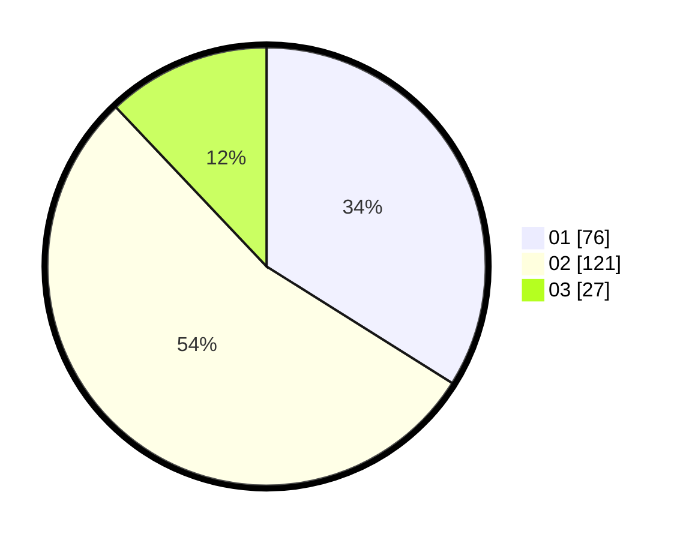

# Hasil

Hasil perolehan suara paslon dapat dilihat pada file paslon-01.txt, paslon-02.txt, dan paslon-03.txt.

Jika tidak ada, artinya data tersebut belum ada pada SIREKAP.

## Perolehan Suara

 * Paslon 01: **76**.
 * Paslon 02: **121**.
 * Paslon 03: **27**.

## Foto C Plano

https://sirekap-obj-formc.kpu.go.id/8329/pemilu/ppwp/31/72/04/10/07/3172041007178-20240214-201639--4632e66e-99f7-48c0-87ed-ed94d07da459.jpg

https://sirekap-obj-formc.kpu.go.id/8329/pemilu/ppwp/31/72/04/10/07/3172041007178-20240214-201852--366c0019-e978-4395-acc0-022da3b7fbe9.jpg

https://sirekap-obj-formc.kpu.go.id/8329/pemilu/ppwp/31/72/04/10/07/3172041007178-20240216-143415--719ed171-851e-42d9-9809-e732a5f5b0bb.jpg

## DATA PEMILIH TETAP

Jumlah pemilih dalam DPT: **290**.
 * L: **141**.
 * P: **149**.

## DATA PENGGUNA HAK PILIH

Jumlah pengguna hak pilih dalam DPT: **225**.
 * L: **103**.
 * P: **122**.

Jumlah pengguna hak pilih dalam DPTb: **0**.
 * L: **0**.
 * P: **0**.

Jumlah pengguna hak pilih dalam DPK: **3**.
 * L: **1**.
 * P: **2**.

Jumlah pengguna hak pilih: **228**.
 * L: **104**.
 * P: **124**.

## JUMLAH SUARA SAH DAN TIDAK SAH

JUMLAH SELURUH SUARA SAH: **224**.

JUMLAH SUARA TIDAK SAH: **4**.

JUMLAH SELURUH SUARA SAH DAN SUARA TIDAK SAH: **228**.
