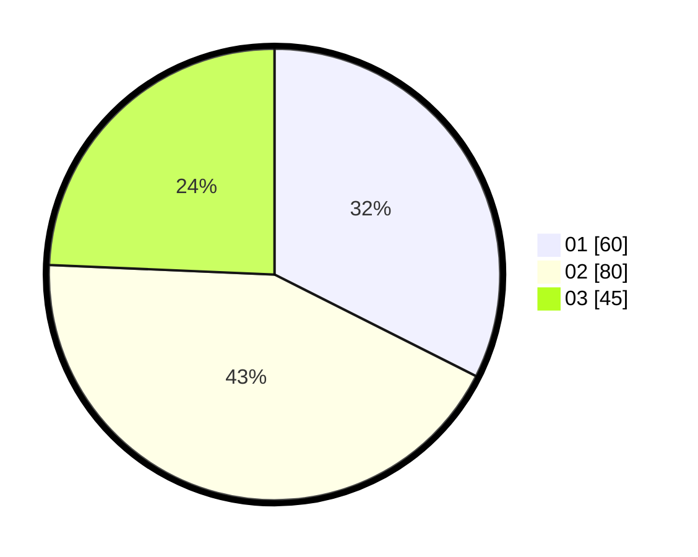

# Hasil

Hasil perolehan suara paslon dapat dilihat pada file paslon-01.txt, paslon-02.txt, dan paslon-03.txt.

Jika tidak ada, artinya data tersebut belum ada pada SIREKAP.

## Perolehan Suara

 * Paslon 01: **60**.
 * Paslon 02: **80**.
 * Paslon 03: **45**.

## Foto C Plano

https://sirekap-obj-formc.kpu.go.id/6726/pemilu/ppwp/31/72/04/10/07/3172041007180-20240215-151849--8b574924-1962-482b-910e-01612e7ab6d0.jpg

https://sirekap-obj-formc.kpu.go.id/6726/pemilu/ppwp/31/72/04/10/07/3172041007180-20240215-004603--0c2a9e0e-b272-417f-8a46-79638978dcb1.jpg

https://sirekap-obj-formc.kpu.go.id/6726/pemilu/ppwp/31/72/04/10/07/3172041007180-20240215-004607--c9709f34-0b84-40ef-b833-ad278799918b.jpg
