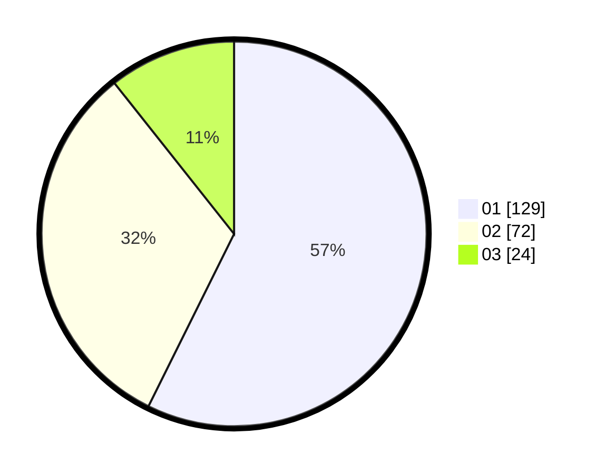

# Hasil

Hasil perolehan suara paslon dapat dilihat pada file paslon-01.txt, paslon-02.txt, dan paslon-03.txt.

Jika tidak ada, artinya data tersebut belum ada pada SIREKAP.

## Perolehan Suara

 * Paslon 01: **129**.
 * Paslon 02: **72**.
 * Paslon 03: **24**.

## Foto C Plano

https://sirekap-obj-formc.kpu.go.id/f90e/pemilu/ppwp/31/72/04/10/07/3172041007183-20240214-184540--5c0ca733-5268-47de-ad9f-a30f690d965e.jpg

https://sirekap-obj-formc.kpu.go.id/f90e/pemilu/ppwp/31/72/04/10/07/3172041007183-20240214-184550--e8afff88-f3b1-42bb-af9b-781e63586833.jpg

https://sirekap-obj-formc.kpu.go.id/f90e/pemilu/ppwp/31/72/04/10/07/3172041007183-20240214-184557--1b901ce5-ecae-4b50-b13f-c566538a48f9.jpg

## DATA PEMILIH TETAP

Jumlah pemilih dalam DPT: **298**.
 * L: **151**.
 * P: **147**.

## DATA PENGGUNA HAK PILIH

Jumlah pengguna hak pilih dalam DPT: **226**.
 * L: **111**.
 * P: **115**.

Jumlah pengguna hak pilih dalam DPTb: **0**.
 * L: **0**.
 * P: **0**.

Jumlah pengguna hak pilih dalam DPK: **3**.
 * L: **2**.
 * P: **1**.

Jumlah pengguna hak pilih: **229**.
 * L: **113**.
 * P: **116**.

## JUMLAH SUARA SAH DAN TIDAK SAH

JUMLAH SELURUH SUARA SAH: **225**.

JUMLAH SUARA TIDAK SAH: **4**.

JUMLAH SELURUH SUARA SAH DAN SUARA TIDAK SAH: **229**.
