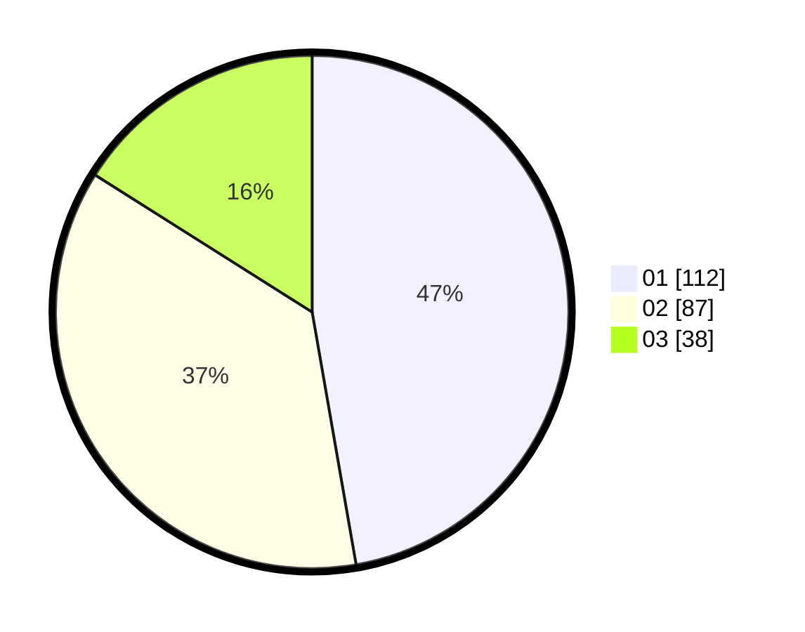

# Hasil

Hasil perolehan suara paslon dapat dilihat pada file paslon-01.txt, paslon-02.txt, dan paslon-03.txt.

Jika tidak ada, artinya data tersebut belum ada pada SIREKAP.

## Perolehan Suara

 * Paslon 01: **112**.
 * Paslon 02: **87**.
 * Paslon 03: **38**.

## Foto C Plano

https://sirekap-obj-formc.kpu.go.id/74ac/pemilu/ppwp/31/72/04/10/07/3172041007186-20240214-175325--62e12527-f199-4442-84bd-3f5e1875de6d.jpg

https://sirekap-obj-formc.kpu.go.id/74ac/pemilu/ppwp/31/72/04/10/07/3172041007186-20240214-175437--510576f6-7cc3-4fb5-b31d-f1756aef7dde.jpg

https://sirekap-obj-formc.kpu.go.id/74ac/pemilu/ppwp/31/72/04/10/07/3172041007186-20240214-181815--3df6fe25-7ecf-4623-b33f-3e59bbb5b1c9.jpg

## DATA PEMILIH TETAP

Jumlah pemilih dalam DPT: **295**.
 * L: **137**.
 * P: **158**.

## DATA PENGGUNA HAK PILIH

Jumlah pengguna hak pilih dalam DPT: **238**.
 * L: **109**.
 * P: **129**.

Jumlah pengguna hak pilih dalam DPTb: **0**.
 * L: **0**.
 * P: **0**.

Jumlah pengguna hak pilih dalam DPK: **2**.
 * L: **0**.
 * P: **2**.

Jumlah pengguna hak pilih: **240**.
 * L: **109**.
 * P: **131**.

## JUMLAH SUARA SAH DAN TIDAK SAH

JUMLAH SELURUH SUARA SAH: **237**.

JUMLAH SUARA TIDAK SAH: **3**.

JUMLAH SELURUH SUARA SAH DAN SUARA TIDAK SAH: **240**.
