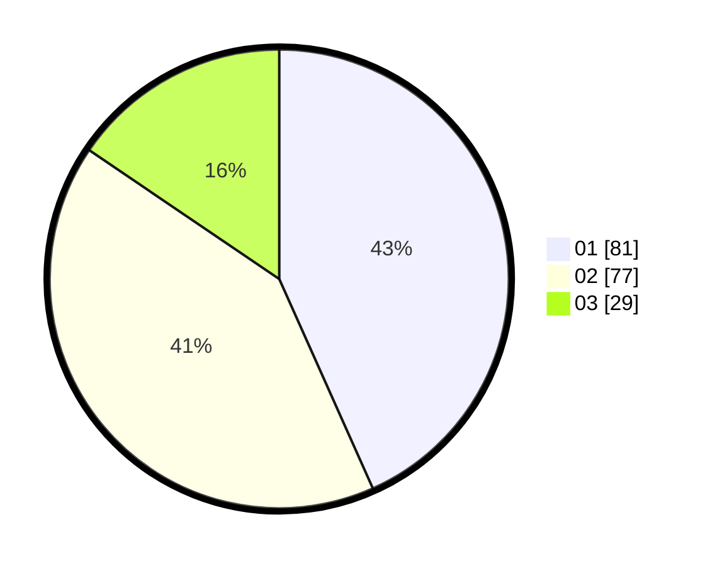

# Hasil

Hasil perolehan suara paslon dapat dilihat pada file paslon-01.txt, paslon-02.txt, dan paslon-03.txt.

Jika tidak ada, artinya data tersebut belum ada pada SIREKAP.

## Perolehan Suara

 * Paslon 01: **81**.
 * Paslon 02: **77**.
 * Paslon 03: **29**.

## Foto C Plano

https://sirekap-obj-formc.kpu.go.id/7b50/pemilu/ppwp/31/72/04/10/07/3172041007191-20240214-155018--dbd27a48-11b2-437b-bb0e-2125a94995af.jpg

https://sirekap-obj-formc.kpu.go.id/7b50/pemilu/ppwp/31/72/04/10/07/3172041007191-20240214-155137--4630aa72-44f2-4bac-8e60-a87efcd0ae27.jpg

https://sirekap-obj-formc.kpu.go.id/7b50/pemilu/ppwp/31/72/04/10/07/3172041007191-20240214-155306--5a105712-24df-4666-84e3-26f2bd8fe58f.jpg

## DATA PEMILIH TETAP

Jumlah pemilih dalam DPT: **267**.
 * L: **138**.
 * P: **129**.

## DATA PENGGUNA HAK PILIH

Jumlah pengguna hak pilih dalam DPT: **187**.
 * L: **85**.
 * P: **102**.

Jumlah pengguna hak pilih dalam DPTb: **0**.
 * L: **0**.
 * P: **0**.

Jumlah pengguna hak pilih dalam DPK: **5**.
 * L: **1**.
 * P: **4**.

Jumlah pengguna hak pilih: **192**.
 * L: **86**.
 * P: **106**.

## JUMLAH SUARA SAH DAN TIDAK SAH

JUMLAH SELURUH SUARA SAH: **187**.

JUMLAH SUARA TIDAK SAH: **5**.

JUMLAH SELURUH SUARA SAH DAN SUARA TIDAK SAH: **192**.
