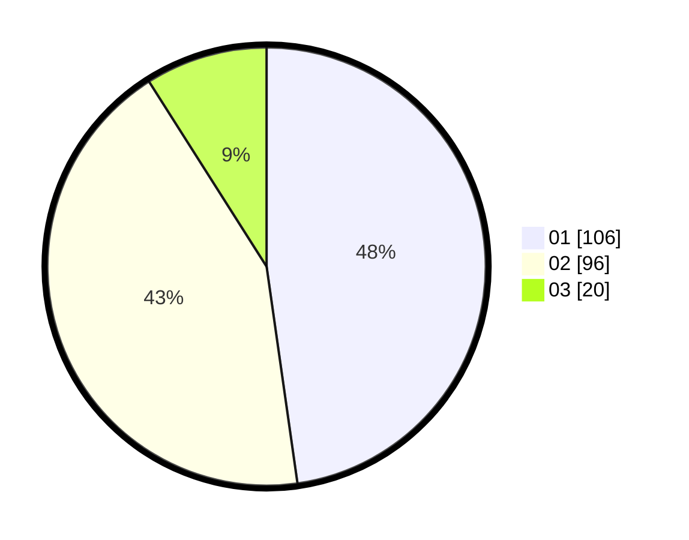

# Hasil

Hasil perolehan suara paslon dapat dilihat pada file paslon-01.txt, paslon-02.txt, dan paslon-03.txt.

Jika tidak ada, artinya data tersebut belum ada pada SIREKAP.

## Perolehan Suara

 * Paslon 01: **106**.
 * Paslon 02: **96**.
 * Paslon 03: **20**.

## Foto C Plano

https://sirekap-obj-formc.kpu.go.id/0342/pemilu/ppwp/31/72/04/10/07/3172041007205-20240214-223818--08271c52-5f2d-4bf0-8293-9670d577721f.jpg

https://sirekap-obj-formc.kpu.go.id/0342/pemilu/ppwp/31/72/04/10/07/3172041007205-20240214-224010--5bc76e9e-598d-499b-a545-7f0201cb7622.jpg

https://sirekap-obj-formc.kpu.go.id/0342/pemilu/ppwp/31/72/04/10/07/3172041007205-20240214-224140--449b472b-eace-4332-804f-1c80f672b25f.jpg

## DATA PEMILIH TETAP

Jumlah pemilih dalam DPT: **295**.
 * L: **153**.
 * P: **142**.

## DATA PENGGUNA HAK PILIH

Jumlah pengguna hak pilih dalam DPT: **227**.
 * L: **108**.
 * P: **119**.

Jumlah pengguna hak pilih dalam DPTb: **0**.
 * L: **0**.
 * P: **0**.

Jumlah pengguna hak pilih dalam DPK: **4**.
 * L: **3**.
 * P: **1**.

Jumlah pengguna hak pilih: **231**.
 * L: **111**.
 * P: **120**.

## JUMLAH SUARA SAH DAN TIDAK SAH

JUMLAH SELURUH SUARA SAH: **222**.

JUMLAH SUARA TIDAK SAH: **9**.

JUMLAH SELURUH SUARA SAH DAN SUARA TIDAK SAH: **234**.
