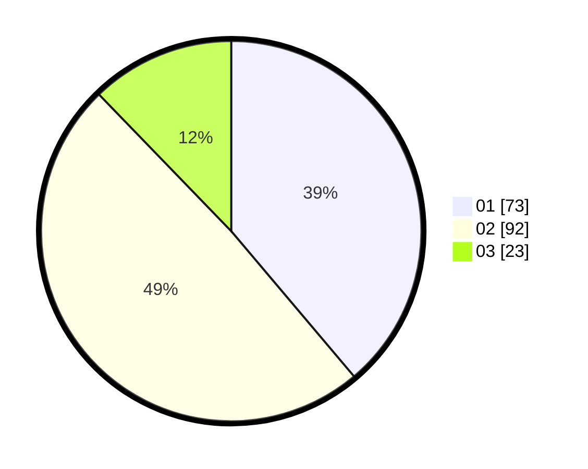

# Hasil

Hasil perolehan suara paslon dapat dilihat pada file paslon-01.txt, paslon-02.txt, dan paslon-03.txt.

Jika tidak ada, artinya data tersebut belum ada pada SIREKAP.

## Perolehan Suara

 * Paslon 01: **73**.
 * Paslon 02: **92**.
 * Paslon 03: **23**.

## Foto C Plano

https://sirekap-obj-formc.kpu.go.id/7cfb/pemilu/ppwp/31/72/04/10/07/3172041007222-20240214-222304--a8ca69ac-e50e-49fa-9e87-469ba44a6f4f.jpg

https://sirekap-obj-formc.kpu.go.id/7cfb/pemilu/ppwp/31/72/04/10/07/3172041007222-20240214-215816--8f9f7921-7538-46de-b819-90d4ab67c594.jpg

https://sirekap-obj-formc.kpu.go.id/7cfb/pemilu/ppwp/31/72/04/10/07/3172041007222-20240214-215901--3f69c95e-6e7f-4b14-bae9-cf2016c29434.jpg

## DATA PEMILIH TETAP

Jumlah pemilih dalam DPT: **235**.
 * L: **108**.
 * P: **127**.

## DATA PENGGUNA HAK PILIH

Jumlah pengguna hak pilih dalam DPT: **188**.
 * L: **83**.
 * P: **105**.

Jumlah pengguna hak pilih dalam DPTb: **0**.
 * L: **0**.
 * P: **0**.

Jumlah pengguna hak pilih dalam DPK: **4**.
 * L: **3**.
 * P: **1**.

Jumlah pengguna hak pilih: **192**.
 * L: **86**.
 * P: **106**.

## JUMLAH SUARA SAH DAN TIDAK SAH

JUMLAH SELURUH SUARA SAH: **188**.

JUMLAH SUARA TIDAK SAH: **4**.

JUMLAH SELURUH SUARA SAH DAN SUARA TIDAK SAH: **192**.
