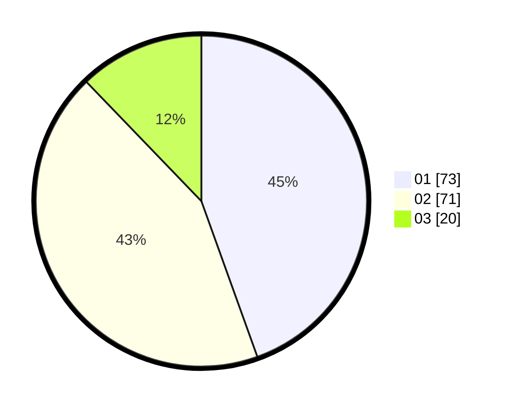

# Hasil

Hasil perolehan suara paslon dapat dilihat pada file paslon-01.txt, paslon-02.txt, dan paslon-03.txt.

Jika tidak ada, artinya data tersebut belum ada pada SIREKAP.

## Perolehan Suara

 * Paslon 01: **73**.
 * Paslon 02: **71**.
 * Paslon 03: **20**.

## Foto C Plano

https://sirekap-obj-formc.kpu.go.id/6359/pemilu/ppwp/31/72/04/10/07/3172041007225-20240214-193942--bbe801c8-ac8e-4405-9680-c29a684777c8.jpg

https://sirekap-obj-formc.kpu.go.id/6359/pemilu/ppwp/31/72/04/10/07/3172041007225-20240214-194100--4a806e8e-d940-4beb-9526-343c3d9e9599.jpg

https://sirekap-obj-formc.kpu.go.id/6359/pemilu/ppwp/31/72/04/10/07/3172041007225-20240214-194142--92605c8e-1a2e-4ffe-adbb-b829519bd577.jpg

## DATA PEMILIH TETAP

Jumlah pemilih dalam DPT: **212**.
 * L: **109**.
 * P: **103**.

## DATA PENGGUNA HAK PILIH

Jumlah pengguna hak pilih dalam DPT: **170**.
 * L: **83**.
 * P: **87**.

Jumlah pengguna hak pilih dalam DPTb: **0**.
 * L: **0**.
 * P: **0**.

Jumlah pengguna hak pilih dalam DPK: **0**.
 * L: **0**.
 * P: **0**.

Jumlah pengguna hak pilih: **170**.
 * L: **83**.
 * P: **87**.

## JUMLAH SUARA SAH DAN TIDAK SAH

JUMLAH SELURUH SUARA SAH: **164**.

JUMLAH SUARA TIDAK SAH: **6**.

JUMLAH SELURUH SUARA SAH DAN SUARA TIDAK SAH: **170**.
