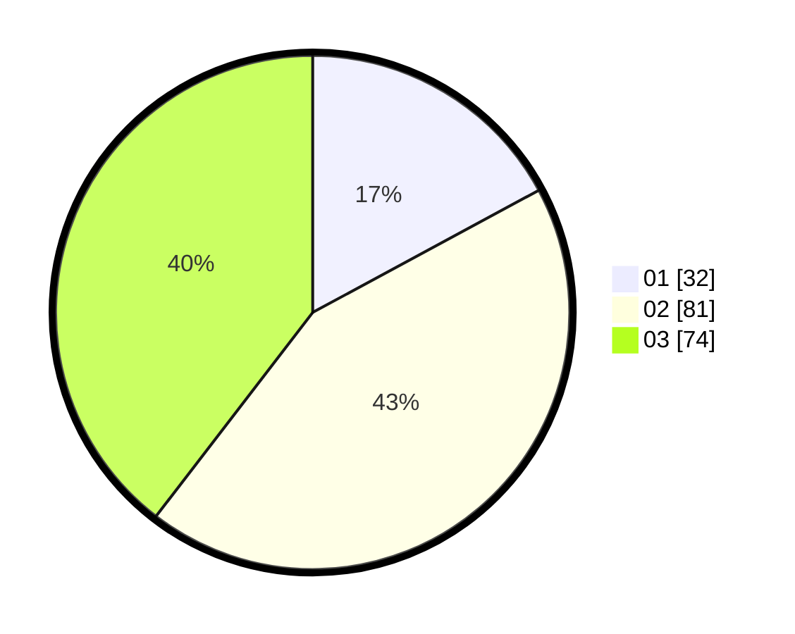

# Hasil

Hasil perolehan suara paslon dapat dilihat pada file paslon-01.txt, paslon-02.txt, dan paslon-03.txt.

Jika tidak ada, artinya data tersebut belum ada pada SIREKAP.

## Perolehan Suara

 * Paslon 01: **32**.
 * Paslon 02: **81**.
 * Paslon 03: **74**.

## Foto C Plano

https://sirekap-obj-formc.kpu.go.id/08ff/pemilu/ppwp/31/72/05/10/01/3172051001001-20240217-101842--5430e961-342e-4626-a44b-6bd54d8258d9.jpg

https://sirekap-obj-formc.kpu.go.id/08ff/pemilu/ppwp/31/72/05/10/01/3172051001001-20240217-101939--3c2f80e6-ef11-43dc-852f-5df8e28a5157.jpg

https://sirekap-obj-formc.kpu.go.id/08ff/pemilu/ppwp/31/72/05/10/01/3172051001001-20240217-102036--a7380c3f-bef8-4162-bc15-04e08bd0924c.jpg

## DATA PEMILIH TETAP

Jumlah pemilih dalam DPT: **280**.
 * L: **136**.
 * P: **144**.

## DATA PENGGUNA HAK PILIH

Jumlah pengguna hak pilih dalam DPT: **180**.
 * L: **84**.
 * P: **96**.

Jumlah pengguna hak pilih dalam DPTb: **7**.
 * L: **2**.
 * P: **5**.

Jumlah pengguna hak pilih dalam DPK: **1**.
 * L: **1**.
 * P: **0**.

Jumlah pengguna hak pilih: **188**.
 * L: **87**.
 * P: **101**.

## JUMLAH SUARA SAH DAN TIDAK SAH

JUMLAH SELURUH SUARA SAH: **187**.

JUMLAH SUARA TIDAK SAH: **1**.

JUMLAH SELURUH SUARA SAH DAN SUARA TIDAK SAH: **188**.
