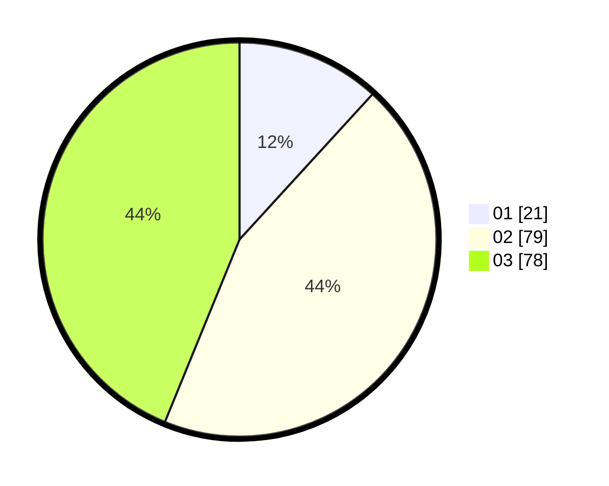

# Hasil

Hasil perolehan suara paslon dapat dilihat pada file paslon-01.txt, paslon-02.txt, dan paslon-03.txt.

Jika tidak ada, artinya data tersebut belum ada pada SIREKAP.

## Perolehan Suara

 * Paslon 01: **21**.
 * Paslon 02: **79**.
 * Paslon 03: **78**.

## Foto C Plano

https://sirekap-obj-formc.kpu.go.id/a072/pemilu/ppwp/31/72/05/10/01/3172051001002-20240217-104959--c713c6bf-fbee-46b4-a8df-2ec3661622e0.jpg

https://sirekap-obj-formc.kpu.go.id/a072/pemilu/ppwp/31/72/05/10/01/3172051001002-20240217-105047--9f9ddce5-d027-4a4d-8764-34210e2e1f2e.jpg

https://sirekap-obj-formc.kpu.go.id/a072/pemilu/ppwp/31/72/05/10/01/3172051001002-20240217-105136--bc5ac57b-bf41-49f3-b470-e6860af739cb.jpg

## DATA PEMILIH TETAP

Jumlah pemilih dalam DPT: **288**.
 * L: **142**.
 * P: **146**.

## DATA PENGGUNA HAK PILIH

Jumlah pengguna hak pilih dalam DPT: **178**.
 * L: **84**.
 * P: **94**.

Jumlah pengguna hak pilih dalam DPTb: **0**.
 * L: **0**.
 * P: **0**.

Jumlah pengguna hak pilih dalam DPK: **0**.
 * L: **0**.
 * P: **0**.

Jumlah pengguna hak pilih: **178**.
 * L: **84**.
 * P: **94**.

## JUMLAH SUARA SAH DAN TIDAK SAH

JUMLAH SELURUH SUARA SAH: **178**.

JUMLAH SUARA TIDAK SAH: **0**.

JUMLAH SELURUH SUARA SAH DAN SUARA TIDAK SAH: **178**.
