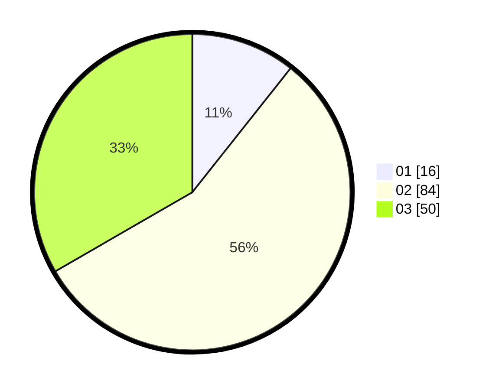

# Hasil

Hasil perolehan suara paslon dapat dilihat pada file paslon-01.txt, paslon-02.txt, dan paslon-03.txt.

Jika tidak ada, artinya data tersebut belum ada pada SIREKAP.

## Perolehan Suara

 * Paslon 01: **16**.
 * Paslon 02: **84**.
 * Paslon 03: **50**.

## Foto C Plano

https://sirekap-obj-formc.kpu.go.id/671a/pemilu/ppwp/31/72/05/10/01/3172051001011-20240214-155452--c059234d-7f25-40cc-afdf-6fc5998e6041.jpg

https://sirekap-obj-formc.kpu.go.id/671a/pemilu/ppwp/31/72/05/10/01/3172051001011-20240214-155645--df3fd3d1-1b64-408d-95b4-c2489e76de43.jpg

https://sirekap-obj-formc.kpu.go.id/671a/pemilu/ppwp/31/72/05/10/01/3172051001011-20240214-155747--feae3905-7075-422b-aef2-a1014c63bd30.jpg

## DATA PEMILIH TETAP

Jumlah pemilih dalam DPT: **285**.
 * L: **151**.
 * P: **134**.

## DATA PENGGUNA HAK PILIH

Jumlah pengguna hak pilih dalam DPT: **150**.
 * L: **82**.
 * P: **68**.

Jumlah pengguna hak pilih dalam DPTb: **1**.
 * L: **1**.
 * P: **0**.

Jumlah pengguna hak pilih dalam DPK: **0**.
 * L: **0**.
 * P: **0**.

Jumlah pengguna hak pilih: **151**.
 * L: **83**.
 * P: **68**.

## JUMLAH SUARA SAH DAN TIDAK SAH

JUMLAH SELURUH SUARA SAH: **150**.

JUMLAH SUARA TIDAK SAH: **1**.

JUMLAH SELURUH SUARA SAH DAN SUARA TIDAK SAH: **151**.
