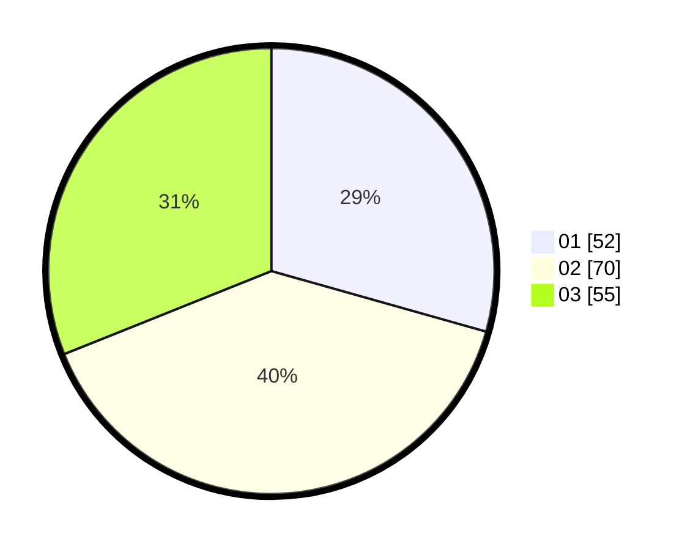

# Hasil

Hasil perolehan suara paslon dapat dilihat pada file paslon-01.txt, paslon-02.txt, dan paslon-03.txt.

Jika tidak ada, artinya data tersebut belum ada pada SIREKAP.

## Perolehan Suara

 * Paslon 01: **52**.
 * Paslon 02: **70**.
 * Paslon 03: **55**.

## Foto C Plano

https://sirekap-obj-formc.kpu.go.id/f1a0/pemilu/ppwp/31/72/05/10/01/3172051001012-20240214-185405--7dbf3048-7d68-409e-9595-ca9f5dbcb5a0.jpg

https://sirekap-obj-formc.kpu.go.id/f1a0/pemilu/ppwp/31/72/05/10/01/3172051001012-20240214-175452--c3de3b26-ce67-499c-a8b8-b4503e9e55d9.jpg

https://sirekap-obj-formc.kpu.go.id/f1a0/pemilu/ppwp/31/72/05/10/01/3172051001012-20240214-175316--fdc9eafe-9a8d-47d7-bf6a-bb9610fa9b94.jpg

## DATA PEMILIH TETAP

Jumlah pemilih dalam DPT: **288**.
 * L: **137**.
 * P: **151**.

## DATA PENGGUNA HAK PILIH

Jumlah pengguna hak pilih dalam DPT: **180**.
 * L: **82**.
 * P: **98**.

Jumlah pengguna hak pilih dalam DPTb: **0**.
 * L: **0**.
 * P: **0**.

Jumlah pengguna hak pilih dalam DPK: **0**.
 * L: **0**.
 * P: **0**.

Jumlah pengguna hak pilih: **180**.
 * L: **82**.
 * P: **98**.

## JUMLAH SUARA SAH DAN TIDAK SAH

JUMLAH SELURUH SUARA SAH: **177**.

JUMLAH SUARA TIDAK SAH: **3**.

JUMLAH SELURUH SUARA SAH DAN SUARA TIDAK SAH: **180**.
