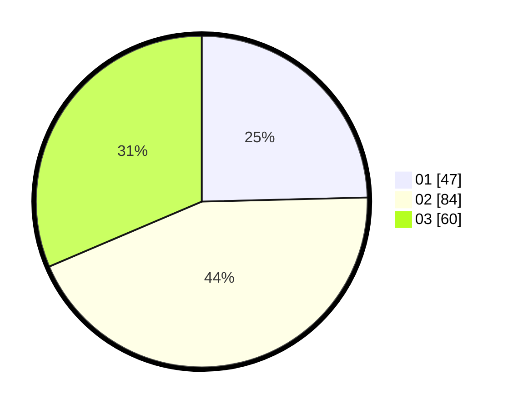

# Hasil

Hasil perolehan suara paslon dapat dilihat pada file paslon-01.txt, paslon-02.txt, dan paslon-03.txt.

Jika tidak ada, artinya data tersebut belum ada pada SIREKAP.

## Perolehan Suara

 * Paslon 01: **47**.
 * Paslon 02: **84**.
 * Paslon 03: **60**.

## Foto C Plano

https://sirekap-obj-formc.kpu.go.id/fb5b/pemilu/ppwp/31/72/05/10/01/3172051001015-20240214-155613--eb7a9af3-a0a5-436f-81e8-17756b428e4e.jpg

https://sirekap-obj-formc.kpu.go.id/fb5b/pemilu/ppwp/31/72/05/10/01/3172051001015-20240214-155714--8e1e30e1-3296-446e-af00-079b5c764fe3.jpg

https://sirekap-obj-formc.kpu.go.id/fb5b/pemilu/ppwp/31/72/05/10/01/3172051001015-20240214-155757--2395c2ea-462d-42ac-9ef8-72e355dc79b0.jpg

## DATA PEMILIH TETAP

Jumlah pemilih dalam DPT: **276**.
 * L: **137**.
 * P: **139**.

## DATA PENGGUNA HAK PILIH

Jumlah pengguna hak pilih dalam DPT: **193**.
 * L: **91**.
 * P: **102**.

Jumlah pengguna hak pilih dalam DPTb: **0**.
 * L: **0**.
 * P: **0**.

Jumlah pengguna hak pilih dalam DPK: **1**.
 * L: **0**.
 * P: **1**.

Jumlah pengguna hak pilih: **194**.
 * L: **91**.
 * P: **103**.

## JUMLAH SUARA SAH DAN TIDAK SAH

JUMLAH SELURUH SUARA SAH: **191**.

JUMLAH SUARA TIDAK SAH: **3**.

JUMLAH SELURUH SUARA SAH DAN SUARA TIDAK SAH: **194**.
