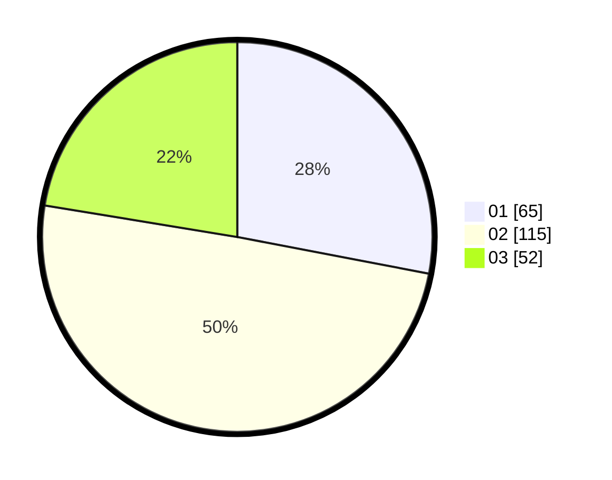

# Hasil

Hasil perolehan suara paslon dapat dilihat pada file paslon-01.txt, paslon-02.txt, dan paslon-03.txt.

Jika tidak ada, artinya data tersebut belum ada pada SIREKAP.

## Perolehan Suara

 * Paslon 01: **65**.
 * Paslon 02: **115**.
 * Paslon 03: **52**.

## Foto C Plano

https://sirekap-obj-formc.kpu.go.id/e8b3/pemilu/ppwp/31/72/05/10/01/3172051001018-20240217-161506--8d45175e-84e6-413b-957a-8bd17a330e30.jpg

https://sirekap-obj-formc.kpu.go.id/e8b3/pemilu/ppwp/31/72/05/10/01/3172051001018-20240217-161922--e7431e91-76bf-4ecb-b978-8a9c1c8860f0.jpg

https://sirekap-obj-formc.kpu.go.id/e8b3/pemilu/ppwp/31/72/05/10/01/3172051001018-20240217-162229--6e3bf6d1-f394-4879-9bb6-d84ea9430442.jpg

## DATA PEMILIH TETAP

Jumlah pemilih dalam DPT: **292**.
 * L: **142**.
 * P: **150**.

## DATA PENGGUNA HAK PILIH

Jumlah pengguna hak pilih dalam DPT: **234**.
 * L: **112**.
 * P: **122**.

Jumlah pengguna hak pilih dalam DPTb: **0**.
 * L: **0**.
 * P: **0**.

Jumlah pengguna hak pilih dalam DPK: **3**.
 * L: **1**.
 * P: **2**.

Jumlah pengguna hak pilih: **237**.
 * L: **113**.
 * P: **124**.

## JUMLAH SUARA SAH DAN TIDAK SAH

JUMLAH SELURUH SUARA SAH: **232**.

JUMLAH SUARA TIDAK SAH: **5**.

JUMLAH SELURUH SUARA SAH DAN SUARA TIDAK SAH: **237**.
