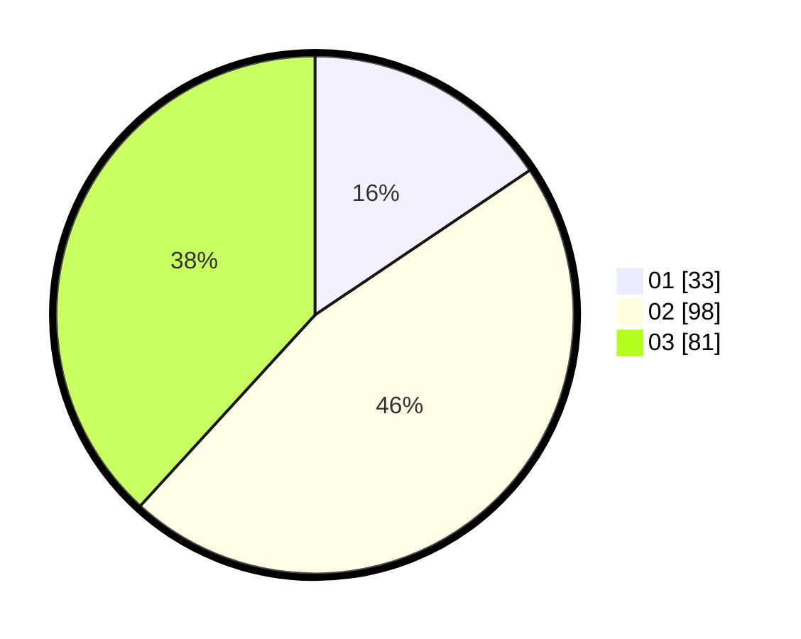

# Hasil

Hasil perolehan suara paslon dapat dilihat pada file paslon-01.txt, paslon-02.txt, dan paslon-03.txt.

Jika tidak ada, artinya data tersebut belum ada pada SIREKAP.

## Perolehan Suara

 * Paslon 01: **33**.
 * Paslon 02: **98**.
 * Paslon 03: **81**.

## Foto C Plano

https://sirekap-obj-formc.kpu.go.id/08e6/pemilu/ppwp/31/72/05/10/01/3172051001023-20240217-224633--65a03453-1fef-4b72-865d-73f6413f529d.jpg

https://sirekap-obj-formc.kpu.go.id/08e6/pemilu/ppwp/31/72/05/10/01/3172051001023-20240217-235442--d0ab2838-260d-4165-b7ed-487fcea604aa.jpg

https://sirekap-obj-formc.kpu.go.id/08e6/pemilu/ppwp/31/72/05/10/01/3172051001023-20240217-225404--a1d14718-2ac8-46d1-a01e-b3c1113981c6.jpg

## DATA PEMILIH TETAP

Jumlah pemilih dalam DPT: **297**.
 * L: **149**.
 * P: **148**.

## DATA PENGGUNA HAK PILIH

Jumlah pengguna hak pilih dalam DPT: **212**.
 * L: **105**.
 * P: **107**.

Jumlah pengguna hak pilih dalam DPTb: **1**.
 * L: **0**.
 * P: **1**.

Jumlah pengguna hak pilih dalam DPK: **0**.
 * L: **0**.
 * P: **0**.

Jumlah pengguna hak pilih: **213**.
 * L: **105**.
 * P: **108**.

## JUMLAH SUARA SAH DAN TIDAK SAH

JUMLAH SELURUH SUARA SAH: **212**.

JUMLAH SUARA TIDAK SAH: **1**.

JUMLAH SELURUH SUARA SAH DAN SUARA TIDAK SAH: **213**.
