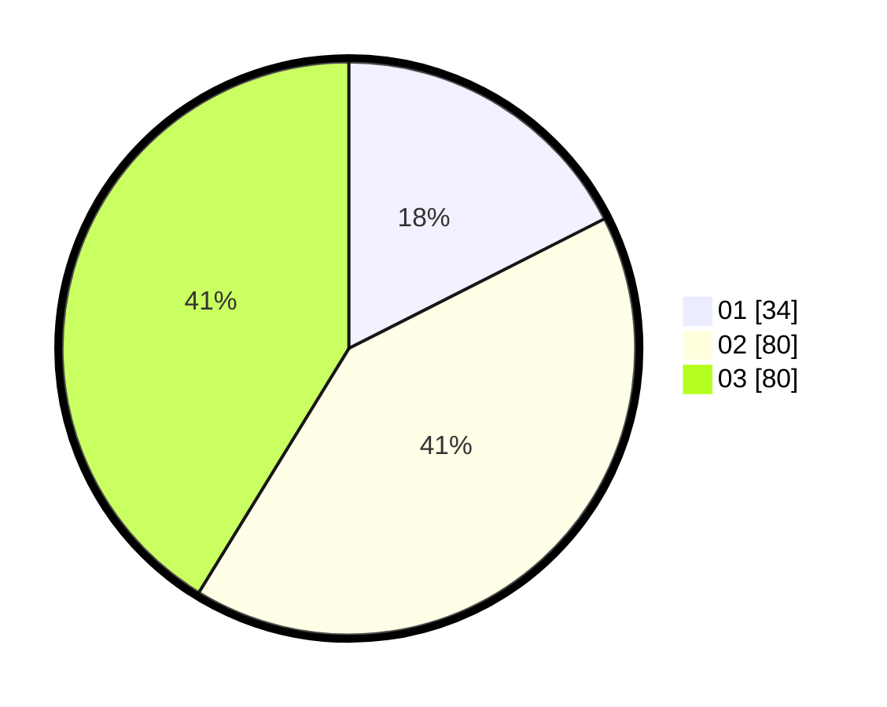

# Hasil

Hasil perolehan suara paslon dapat dilihat pada file paslon-01.txt, paslon-02.txt, dan paslon-03.txt.

Jika tidak ada, artinya data tersebut belum ada pada SIREKAP.

## Perolehan Suara

 * Paslon 01: **34**.
 * Paslon 02: **80**.
 * Paslon 03: **80**.

## Foto C Plano

https://sirekap-obj-formc.kpu.go.id/d2e4/pemilu/ppwp/31/72/05/10/01/3172051001027-20240215-220358--69eec6fd-bc36-47ea-9b2d-1a8576ab3f74.jpg

https://sirekap-obj-formc.kpu.go.id/d2e4/pemilu/ppwp/31/72/05/10/01/3172051001027-20240215-223914--bd90dc61-8842-43d7-847e-9944f2b90a29.jpg

https://sirekap-obj-formc.kpu.go.id/d2e4/pemilu/ppwp/31/72/05/10/01/3172051001027-20240215-225439--c490a960-3b85-4faa-8356-dad7c6838bd8.jpg

## DATA PEMILIH TETAP

Jumlah pemilih dalam DPT: **296**.
 * L: **140**.
 * P: **156**.

## DATA PENGGUNA HAK PILIH

Jumlah pengguna hak pilih dalam DPT: **191**.
 * L: **83**.
 * P: **108**.

Jumlah pengguna hak pilih dalam DPTb: **6**.
 * L: **0**.
 * P: **6**.

Jumlah pengguna hak pilih dalam DPK: **1**.
 * L: **1**.
 * P: **0**.

Jumlah pengguna hak pilih: **198**.
 * L: **84**.
 * P: **114**.

## JUMLAH SUARA SAH DAN TIDAK SAH

JUMLAH SELURUH SUARA SAH: **194**.

JUMLAH SUARA TIDAK SAH: **4**.

JUMLAH SELURUH SUARA SAH DAN SUARA TIDAK SAH: **198**.
