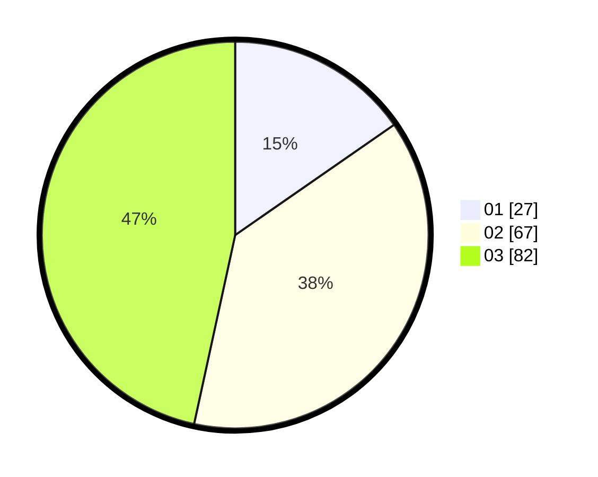

# Hasil

Hasil perolehan suara paslon dapat dilihat pada file paslon-01.txt, paslon-02.txt, dan paslon-03.txt.

Jika tidak ada, artinya data tersebut belum ada pada SIREKAP.

## Perolehan Suara

 * Paslon 01: **27**.
 * Paslon 02: **67**.
 * Paslon 03: **82**.

## Foto C Plano

https://sirekap-obj-formc.kpu.go.id/5d88/pemilu/ppwp/31/72/05/10/01/3172051001037-20240214-193356--80b98f35-f25a-4200-8d58-045cc0e23c1e.jpg

https://sirekap-obj-formc.kpu.go.id/5d88/pemilu/ppwp/31/72/05/10/01/3172051001037-20240214-205250--60790734-1791-4897-a070-072480442bbf.jpg

https://sirekap-obj-formc.kpu.go.id/5d88/pemilu/ppwp/31/72/05/10/01/3172051001037-20240214-205316--ca4215d4-7bd0-42d5-b2e0-bfbcf2694902.jpg

## DATA PEMILIH TETAP

Jumlah pemilih dalam DPT: **283**.
 * L: **141**.
 * P: **142**.

## DATA PENGGUNA HAK PILIH

Jumlah pengguna hak pilih dalam DPT: **180**.
 * L: **88**.
 * P: **92**.

Jumlah pengguna hak pilih dalam DPTb: **0**.
 * L: **0**.
 * P: **0**.

Jumlah pengguna hak pilih dalam DPK: **1**.
 * L: **0**.
 * P: **1**.

Jumlah pengguna hak pilih: **181**.
 * L: **88**.
 * P: **93**.

## JUMLAH SUARA SAH DAN TIDAK SAH

JUMLAH SELURUH SUARA SAH: **176**.

JUMLAH SUARA TIDAK SAH: **5**.

JUMLAH SELURUH SUARA SAH DAN SUARA TIDAK SAH: **181**.
