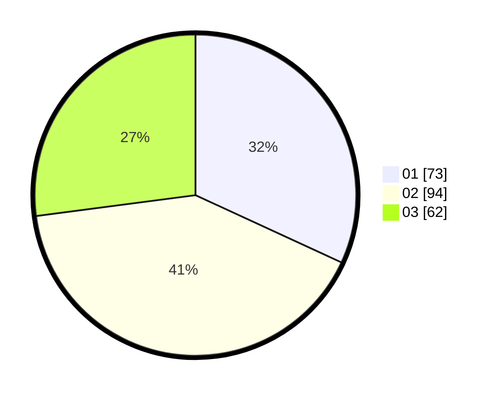

# Hasil

Hasil perolehan suara paslon dapat dilihat pada file paslon-01.txt, paslon-02.txt, dan paslon-03.txt.

Jika tidak ada, artinya data tersebut belum ada pada SIREKAP.

## Perolehan Suara

 * Paslon 01: **73**.
 * Paslon 02: **94**.
 * Paslon 03: **62**.

## Foto C Plano

https://sirekap-obj-formc.kpu.go.id/1e3d/pemilu/ppwp/31/72/05/10/01/3172051001042-20240215-012603--8e0cb58b-0289-4b04-9511-45516bbb78e7.jpg

https://sirekap-obj-formc.kpu.go.id/1e3d/pemilu/ppwp/31/72/05/10/01/3172051001042-20240215-012753--05341605-bfe2-4e33-a540-0d7ec3c5db17.jpg

https://sirekap-obj-formc.kpu.go.id/1e3d/pemilu/ppwp/31/72/05/10/01/3172051001042-20240215-012935--9b57bdd1-3535-4d87-aea9-79c51348d4b2.jpg
