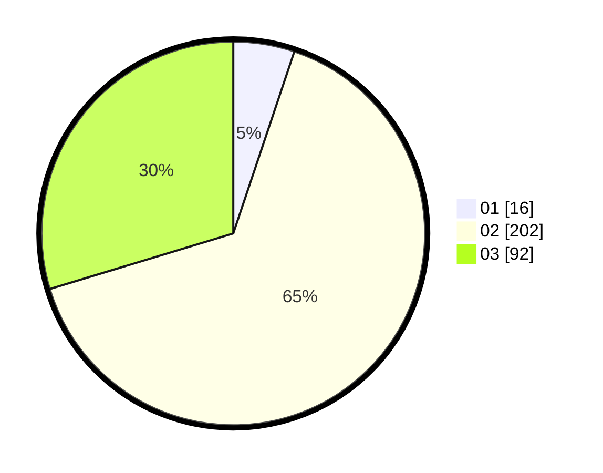

# Hasil

Hasil perolehan suara paslon dapat dilihat pada file paslon-01.txt, paslon-02.txt, dan paslon-03.txt.

Jika tidak ada, artinya data tersebut belum ada pada SIREKAP.

## Perolehan Suara

 * Paslon 01: **16**.
 * Paslon 02: **202**.
 * Paslon 03: **92**.

## Foto C Plano

https://sirekap-obj-formc.kpu.go.id/cc60/pemilu/ppwp/31/72/05/10/01/3172051001046-20240216-165422--5248ec67-3f0e-4ad9-809e-49021f4ad695.jpg

https://sirekap-obj-formc.kpu.go.id/cc60/pemilu/ppwp/31/72/05/10/01/3172051001046-20240214-141910--4cfeb97e-704d-4752-a479-18a197613a8b.jpg

https://sirekap-obj-formc.kpu.go.id/cc60/pemilu/ppwp/31/72/05/10/01/3172051001046-20240214-232541--7ff2cdce-02be-4c5d-8f1d-6941065d7c49.jpg

## DATA PEMILIH TETAP

Jumlah pemilih dalam DPT: **298**.
 * L: **141**.
 * P: **157**.

## DATA PENGGUNA HAK PILIH

Jumlah pengguna hak pilih dalam DPT: **206**.
 * L: **98**.
 * P: **108**.

Jumlah pengguna hak pilih dalam DPTb: **9**.
 * L: **7**.
 * P: **2**.

Jumlah pengguna hak pilih dalam DPK: **1**.
 * L: **0**.
 * P: **1**.

Jumlah pengguna hak pilih: **216**.
 * L: **105**.
 * P: **111**.

## JUMLAH SUARA SAH DAN TIDAK SAH

JUMLAH SELURUH SUARA SAH: **200**.

JUMLAH SUARA TIDAK SAH: **0**.

JUMLAH SELURUH SUARA SAH DAN SUARA TIDAK SAH: **500**.
