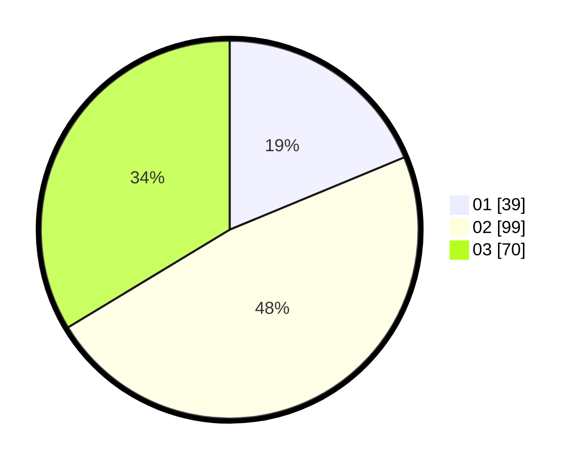

# Hasil

Hasil perolehan suara paslon dapat dilihat pada file paslon-01.txt, paslon-02.txt, dan paslon-03.txt.

Jika tidak ada, artinya data tersebut belum ada pada SIREKAP.

## Perolehan Suara

 * Paslon 01: **39**.
 * Paslon 02: **99**.
 * Paslon 03: **70**.

## Foto C Plano

https://sirekap-obj-formc.kpu.go.id/9c99/pemilu/ppwp/31/72/05/10/01/3172051001048-20240214-235417--2716b785-8eee-463b-8e1f-20e1f308e753.jpg

https://sirekap-obj-formc.kpu.go.id/9c99/pemilu/ppwp/31/72/05/10/01/3172051001048-20240214-235930--f6b82bdf-f224-4715-8ed6-af4fe2bd8cfe.jpg

https://sirekap-obj-formc.kpu.go.id/9c99/pemilu/ppwp/31/72/05/10/01/3172051001048-20240215-000018--55ce91f1-282d-4171-97c1-0b200c233e3a.jpg

## DATA PEMILIH TETAP

Jumlah pemilih dalam DPT: **286**.
 * L: **190**.
 * P: **146**.

## DATA PENGGUNA HAK PILIH

Jumlah pengguna hak pilih dalam DPT: **208**.
 * L: **100**.
 * P: **103**.

Jumlah pengguna hak pilih dalam DPTb: **0**.
 * L: **0**.
 * P: **0**.

Jumlah pengguna hak pilih dalam DPK: **7**.
 * L: **1**.
 * P: **0**.

Jumlah pengguna hak pilih: **209**.
 * L: **101**.
 * P: **108**.

## JUMLAH SUARA SAH DAN TIDAK SAH

JUMLAH SELURUH SUARA SAH: **208**.

JUMLAH SUARA TIDAK SAH: **1**.

JUMLAH SELURUH SUARA SAH DAN SUARA TIDAK SAH: **209**.
