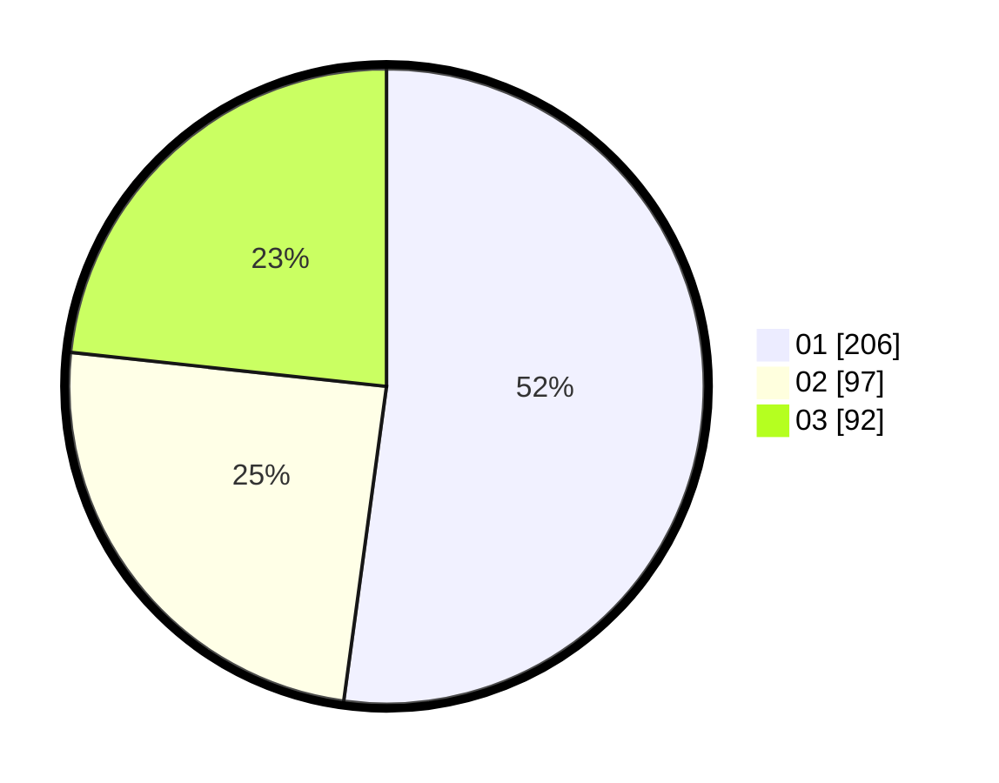

# Hasil

Hasil perolehan suara paslon dapat dilihat pada file paslon-01.txt, paslon-02.txt, dan paslon-03.txt.

Jika tidak ada, artinya data tersebut belum ada pada SIREKAP.

## Perolehan Suara

 * Paslon 01: **206**.
 * Paslon 02: **97**.
 * Paslon 03: **92**.

## Foto C Plano

https://sirekap-obj-formc.kpu.go.id/2790/pemilu/ppwp/31/72/05/10/01/3172051001050-20240217-113104--da653ecd-9829-453d-8fa6-5df512dac658.jpg

https://sirekap-obj-formc.kpu.go.id/2790/pemilu/ppwp/31/72/05/10/01/3172051001050-20240217-171421--1f9507b1-a7ee-4571-8bc0-c48fdb0c15b4.jpg

https://sirekap-obj-formc.kpu.go.id/2790/pemilu/ppwp/31/72/05/10/01/3172051001050-20240217-180231--bd3ef987-6446-47af-915d-b416d55fef45.jpg

## DATA PEMILIH TETAP

Jumlah pemilih dalam DPT: **292**.
 * L: **147**.
 * P: **145**.

## DATA PENGGUNA HAK PILIH

Jumlah pengguna hak pilih dalam DPT: **213**.
 * L: **106**.
 * P: **107**.

Jumlah pengguna hak pilih dalam DPTb: **2**.
 * L: **2**.
 * P: **0**.

Jumlah pengguna hak pilih dalam DPK: **1**.
 * L: **1**.
 * P: **0**.

Jumlah pengguna hak pilih: **216**.
 * L: **109**.
 * P: **107**.

## JUMLAH SUARA SAH DAN TIDAK SAH

JUMLAH SELURUH SUARA SAH: **215**.

JUMLAH SUARA TIDAK SAH: **1**.

JUMLAH SELURUH SUARA SAH DAN SUARA TIDAK SAH: **216**.
