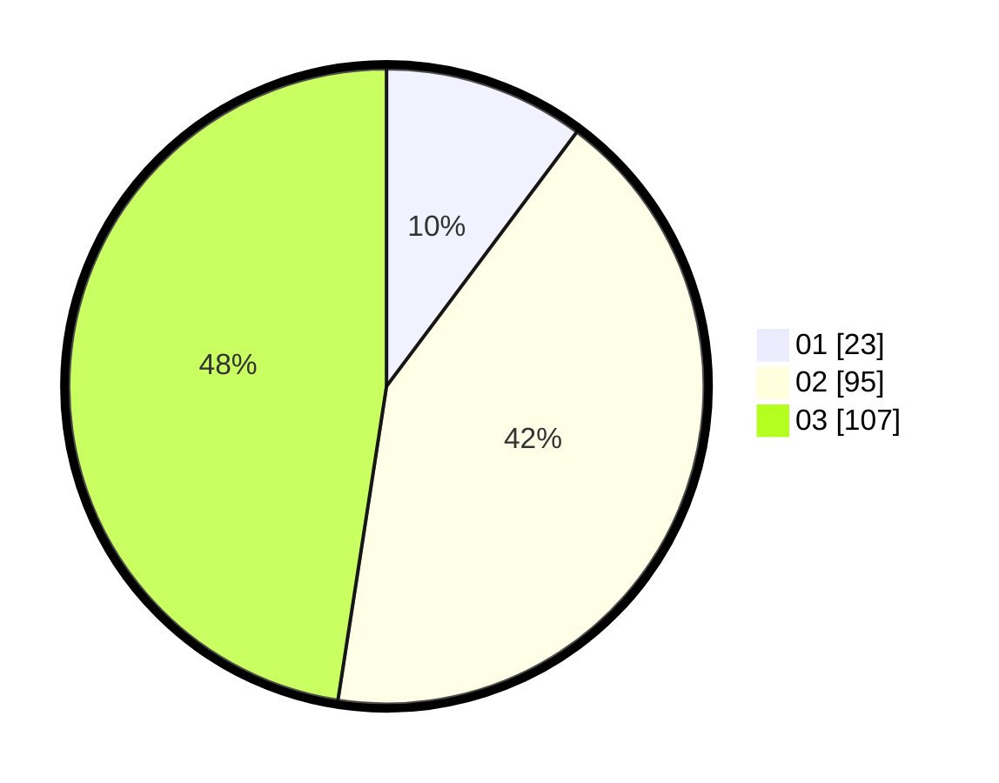

# Hasil

Hasil perolehan suara paslon dapat dilihat pada file paslon-01.txt, paslon-02.txt, dan paslon-03.txt.

Jika tidak ada, artinya data tersebut belum ada pada SIREKAP.

## Perolehan Suara

 * Paslon 01: **23**.
 * Paslon 02: **95**.
 * Paslon 03: **107**.

## Foto C Plano

https://sirekap-obj-formc.kpu.go.id/8699/pemilu/ppwp/31/72/05/10/01/3172051001069-20240214-203218--1466c0ff-b6e7-4b68-9c59-9e1e4550ad67.jpg

https://sirekap-obj-formc.kpu.go.id/8699/pemilu/ppwp/31/72/05/10/01/3172051001069-20240214-203440--e51baf05-fb7c-4aaf-a14f-46e845724afb.jpg

https://sirekap-obj-formc.kpu.go.id/8699/pemilu/ppwp/31/72/05/10/01/3172051001069-20240214-185306--59a27333-d287-435d-bd6f-5293cfa87cc3.jpg

## DATA PEMILIH TETAP

Jumlah pemilih dalam DPT: **295**.
 * L: **131**.
 * P: **164**.

## DATA PENGGUNA HAK PILIH

Jumlah pengguna hak pilih dalam DPT: **229**.
 * L: **97**.
 * P: **132**.

Jumlah pengguna hak pilih dalam DPTb: **3**.
 * L: **1**.
 * P: **2**.

Jumlah pengguna hak pilih dalam DPK: **3**.
 * L: **1**.
 * P: **2**.

Jumlah pengguna hak pilih: **235**.
 * L: **99**.
 * P: **136**.

## JUMLAH SUARA SAH DAN TIDAK SAH

JUMLAH SELURUH SUARA SAH: **225**.

JUMLAH SUARA TIDAK SAH: **10**.

JUMLAH SELURUH SUARA SAH DAN SUARA TIDAK SAH: **235**.
