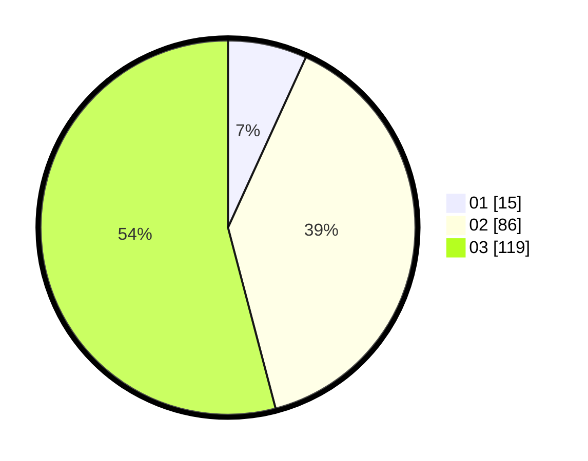

# Hasil

Hasil perolehan suara paslon dapat dilihat pada file paslon-01.txt, paslon-02.txt, dan paslon-03.txt.

Jika tidak ada, artinya data tersebut belum ada pada SIREKAP.

## Perolehan Suara

 * Paslon 01: **15**.
 * Paslon 02: **86**.
 * Paslon 03: **119**.

## Foto C Plano

https://sirekap-obj-formc.kpu.go.id/faa8/pemilu/ppwp/31/72/05/10/01/3172051001073-20240215-005101--b54a6007-3a98-4b54-bc72-8a7cc8ea0870.jpg

https://sirekap-obj-formc.kpu.go.id/faa8/pemilu/ppwp/31/72/05/10/01/3172051001073-20240215-005113--3ccc9a78-7d38-4b55-a934-0aa572735574.jpg

https://sirekap-obj-formc.kpu.go.id/faa8/pemilu/ppwp/31/72/05/10/01/3172051001073-20240215-005119--bd89c528-c83f-42a6-9397-aa08ff0d7ee8.jpg

## DATA PEMILIH TETAP

Jumlah pemilih dalam DPT: **289**.
 * L: **142**.
 * P: **147**.

## DATA PENGGUNA HAK PILIH

Jumlah pengguna hak pilih dalam DPT: **218**.
 * L: **107**.
 * P: **111**.

Jumlah pengguna hak pilih dalam DPTb: **0**.
 * L: **0**.
 * P: **0**.

Jumlah pengguna hak pilih dalam DPK: **4**.
 * L: **2**.
 * P: **2**.

Jumlah pengguna hak pilih: **222**.
 * L: **109**.
 * P: **113**.

## JUMLAH SUARA SAH DAN TIDAK SAH

JUMLAH SELURUH SUARA SAH: **220**.

JUMLAH SUARA TIDAK SAH: **2**.

JUMLAH SELURUH SUARA SAH DAN SUARA TIDAK SAH: **222**.
