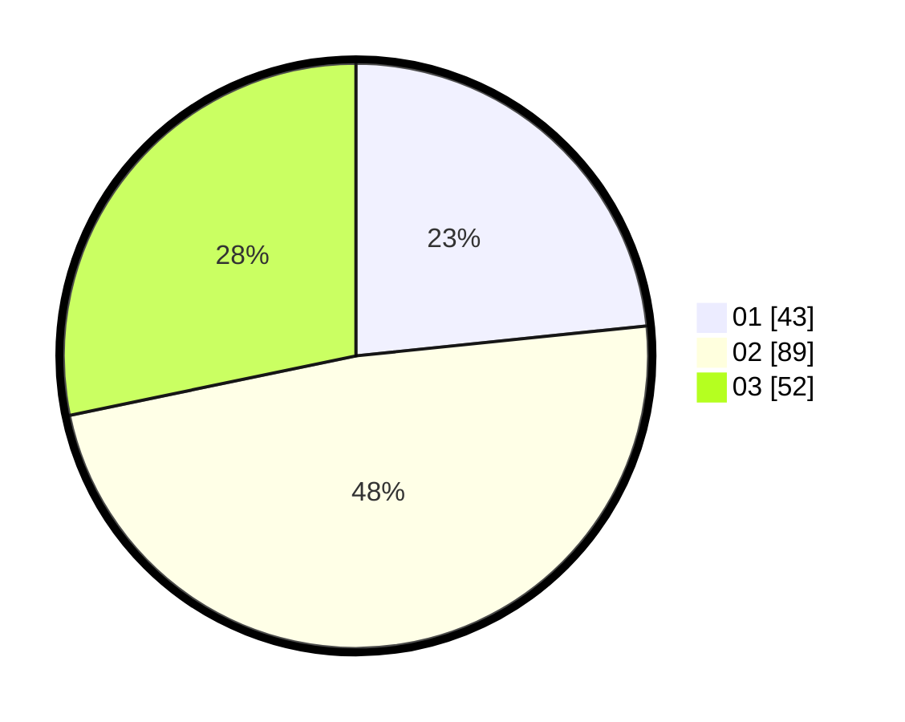

# Hasil

Hasil perolehan suara paslon dapat dilihat pada file paslon-01.txt, paslon-02.txt, dan paslon-03.txt.

Jika tidak ada, artinya data tersebut belum ada pada SIREKAP.

## Perolehan Suara

 * Paslon 01: **43**.
 * Paslon 02: **89**.
 * Paslon 03: **52**.

## Foto C Plano

https://sirekap-obj-formc.kpu.go.id/7d48/pemilu/ppwp/31/72/05/10/01/3172051001097-20240215-160458--fb4a19df-e99a-4c36-b784-79a1944ebd22.jpg

https://sirekap-obj-formc.kpu.go.id/7d48/pemilu/ppwp/31/72/05/10/01/3172051001097-20240215-160523--337deb9b-ed1f-4681-ab4d-2ca642f90470.jpg

https://sirekap-obj-formc.kpu.go.id/7d48/pemilu/ppwp/31/72/05/10/01/3172051001097-20240215-160536--e1aef786-9bb5-43be-9a3d-e8c26a862350.jpg

## DATA PEMILIH TETAP

Jumlah pemilih dalam DPT: **275**.
 * L: **144**.
 * P: **131**.

## DATA PENGGUNA HAK PILIH

Jumlah pengguna hak pilih dalam DPT: **177**.
 * L: **91**.
 * P: **86**.

Jumlah pengguna hak pilih dalam DPTb: **9**.
 * L: **3**.
 * P: **6**.

Jumlah pengguna hak pilih dalam DPK: **0**.
 * L: **0**.
 * P: **0**.

Jumlah pengguna hak pilih: **186**.
 * L: **94**.
 * P: **92**.

## JUMLAH SUARA SAH DAN TIDAK SAH

JUMLAH SELURUH SUARA SAH: **184**.

JUMLAH SUARA TIDAK SAH: **2**.

JUMLAH SELURUH SUARA SAH DAN SUARA TIDAK SAH: **186**.
