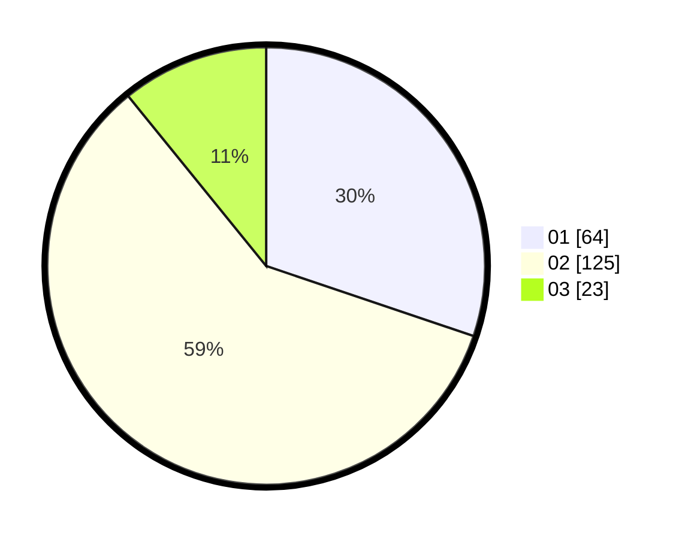

# Hasil

Hasil perolehan suara paslon dapat dilihat pada file paslon-01.txt, paslon-02.txt, dan paslon-03.txt.

Jika tidak ada, artinya data tersebut belum ada pada SIREKAP.

## Perolehan Suara

 * Paslon 01: **64**.
 * Paslon 02: **125**.
 * Paslon 03: **23**.

## Foto C Plano

https://sirekap-obj-formc.kpu.go.id/eb78/pemilu/ppwp/31/72/05/10/01/3172051001114-20240214-225942--9bc4444e-e1ce-433d-ad5d-a6fd1a9a858a.jpg

https://sirekap-obj-formc.kpu.go.id/eb78/pemilu/ppwp/31/72/05/10/01/3172051001114-20240214-230116--01e72eae-957f-4424-8c21-1d5dc33db75d.jpg

https://sirekap-obj-formc.kpu.go.id/eb78/pemilu/ppwp/31/72/05/10/01/3172051001114-20240214-230725--385bf1b6-d015-4f0c-a997-6c9b4b3b4e15.jpg

## DATA PEMILIH TETAP

Jumlah pemilih dalam DPT: **263**.
 * L: **143**.
 * P: **120**.

## DATA PENGGUNA HAK PILIH

Jumlah pengguna hak pilih dalam DPT: **216**.
 * L: **113**.
 * P: **103**.

Jumlah pengguna hak pilih dalam DPTb: **0**.
 * L: **0**.
 * P: **0**.

Jumlah pengguna hak pilih dalam DPK: **0**.
 * L: **0**.
 * P: **0**.

Jumlah pengguna hak pilih: **216**.
 * L: **113**.
 * P: **103**.

## JUMLAH SUARA SAH DAN TIDAK SAH

JUMLAH SELURUH SUARA SAH: **212**.

JUMLAH SUARA TIDAK SAH: **4**.

JUMLAH SELURUH SUARA SAH DAN SUARA TIDAK SAH: **216**.
