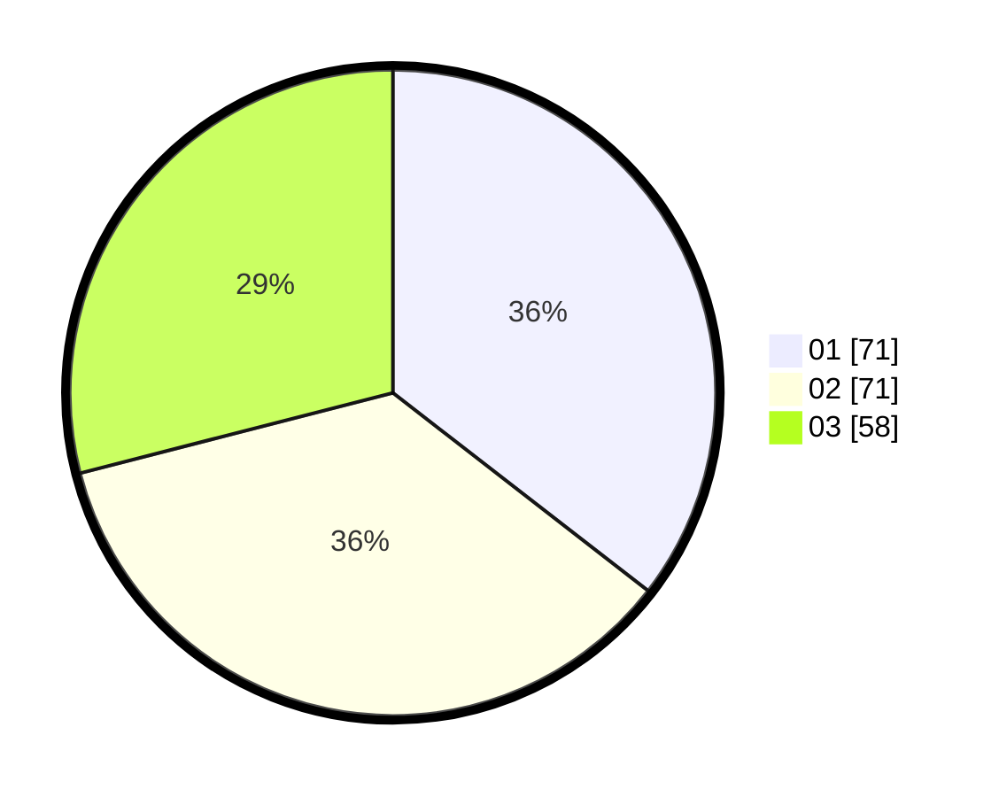

# Hasil

Hasil perolehan suara paslon dapat dilihat pada file paslon-01.txt, paslon-02.txt, dan paslon-03.txt.

Jika tidak ada, artinya data tersebut belum ada pada SIREKAP.

## Perolehan Suara

 * Paslon 01: **71**.
 * Paslon 02: **71**.
 * Paslon 03: **58**.

## Foto C Plano

https://sirekap-obj-formc.kpu.go.id/7cd8/pemilu/ppwp/31/72/05/10/02/3172051002004-20240217-213225--45ad6754-5262-497c-8c74-b9481f2c2a3b.jpg

https://sirekap-obj-formc.kpu.go.id/7cd8/pemilu/ppwp/31/72/05/10/02/3172051002004-20240217-213340--3b77f565-281f-49e0-bad4-8dfd903b49d3.jpg

https://sirekap-obj-formc.kpu.go.id/7cd8/pemilu/ppwp/31/72/05/10/02/3172051002004-20240217-213420--4254342c-5a18-4d81-952e-5d5dff1e9352.jpg

## DATA PEMILIH TETAP

Jumlah pemilih dalam DPT: **277**.
 * L: **139**.
 * P: **138**.

## DATA PENGGUNA HAK PILIH

Jumlah pengguna hak pilih dalam DPT: **202**.
 * L: **100**.
 * P: **102**.

Jumlah pengguna hak pilih dalam DPTb: **0**.
 * L: **0**.
 * P: **0**.

Jumlah pengguna hak pilih dalam DPK: **0**.
 * L: **0**.
 * P: **0**.

Jumlah pengguna hak pilih: **202**.
 * L: **100**.
 * P: **102**.

## JUMLAH SUARA SAH DAN TIDAK SAH

JUMLAH SELURUH SUARA SAH: **200**.

JUMLAH SUARA TIDAK SAH: **2**.

JUMLAH SELURUH SUARA SAH DAN SUARA TIDAK SAH: **202**.
