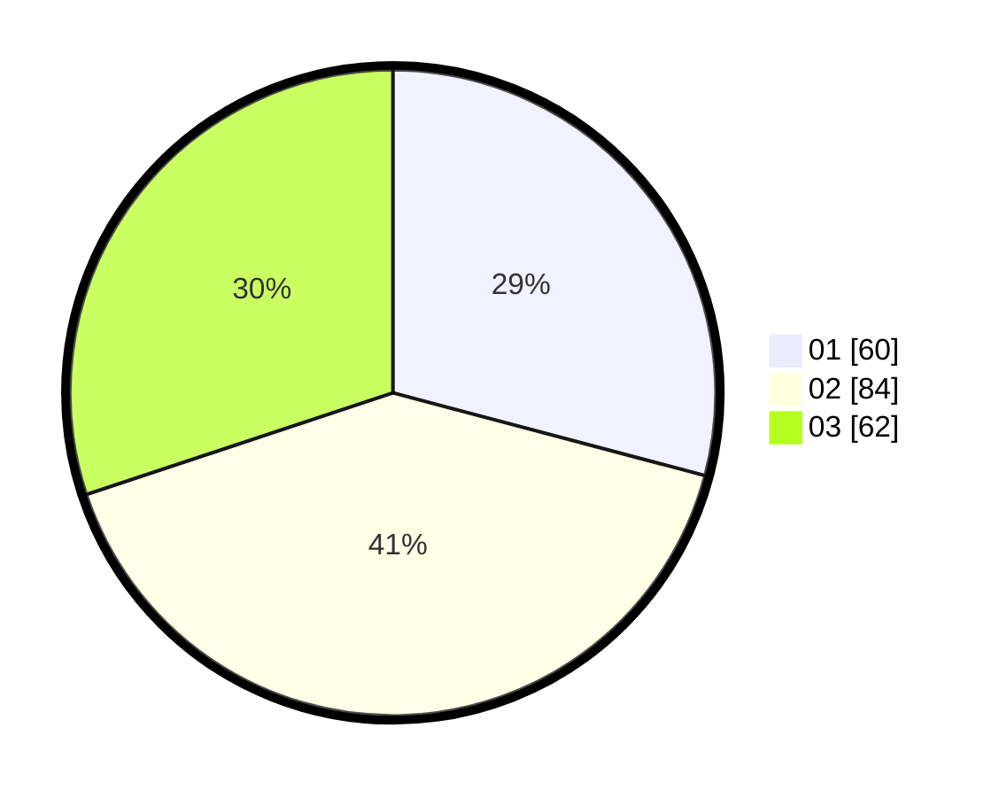

# Hasil

Hasil perolehan suara paslon dapat dilihat pada file paslon-01.txt, paslon-02.txt, dan paslon-03.txt.

Jika tidak ada, artinya data tersebut belum ada pada SIREKAP.

## Perolehan Suara

 * Paslon 01: **60**.
 * Paslon 02: **84**.
 * Paslon 03: **62**.

## Foto C Plano

https://sirekap-obj-formc.kpu.go.id/48d8/pemilu/ppwp/31/72/05/10/02/3172051002006-20240217-210236--a27a6520-a627-41eb-9211-2b551d94039d.jpg

https://sirekap-obj-formc.kpu.go.id/48d8/pemilu/ppwp/31/72/05/10/02/3172051002006-20240217-205854--21aee19f-f5b6-423a-a43f-b808f7792ba9.jpg

https://sirekap-obj-formc.kpu.go.id/48d8/pemilu/ppwp/31/72/05/10/02/3172051002006-20240217-210319--665d5718-c682-4cab-be3e-255b29143e7c.jpg

## DATA PEMILIH TETAP

Jumlah pemilih dalam DPT: **283**.
 * L: **141**.
 * P: **142**.

## DATA PENGGUNA HAK PILIH

Jumlah pengguna hak pilih dalam DPT: **199**.
 * L: **104**.
 * P: **95**.

Jumlah pengguna hak pilih dalam DPTb: **4**.
 * L: **3**.
 * P: **1**.

Jumlah pengguna hak pilih dalam DPK: **4**.
 * L: **2**.
 * P: **2**.

Jumlah pengguna hak pilih: **207**.
 * L: **109**.
 * P: **98**.

## JUMLAH SUARA SAH DAN TIDAK SAH

JUMLAH SELURUH SUARA SAH: **206**.

JUMLAH SUARA TIDAK SAH: **1**.

JUMLAH SELURUH SUARA SAH DAN SUARA TIDAK SAH: **207**.
