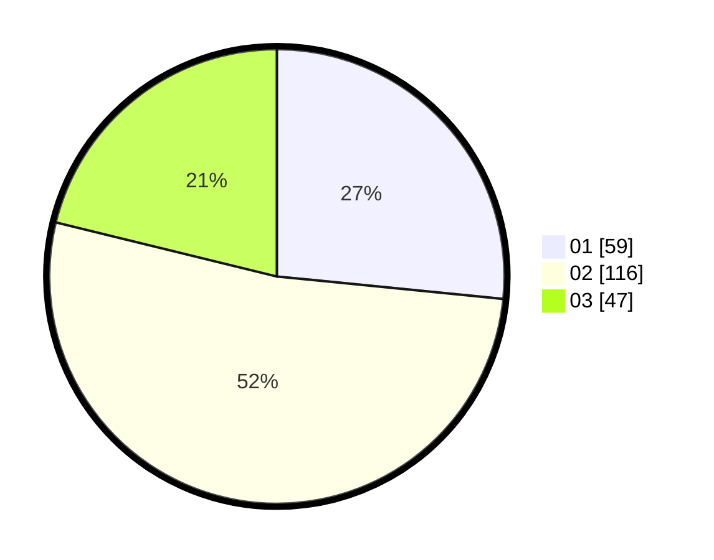

# Hasil

Hasil perolehan suara paslon dapat dilihat pada file paslon-01.txt, paslon-02.txt, dan paslon-03.txt.

Jika tidak ada, artinya data tersebut belum ada pada SIREKAP.

## Perolehan Suara

 * Paslon 01: **59**.
 * Paslon 02: **116**.
 * Paslon 03: **47**.

## Foto C Plano

https://sirekap-obj-formc.kpu.go.id/8034/pemilu/ppwp/31/72/05/10/02/3172051002012-20240214-231231--61274527-2d62-470e-9494-53709da757d5.jpg

https://sirekap-obj-formc.kpu.go.id/8034/pemilu/ppwp/31/72/05/10/02/3172051002012-20240214-231447--7d3d5048-81c9-42a4-9331-617508e583ac.jpg

https://sirekap-obj-formc.kpu.go.id/8034/pemilu/ppwp/31/72/05/10/02/3172051002012-20240214-231514--a60127d6-2d34-4ae3-9e1b-4af58ac2bd77.jpg
