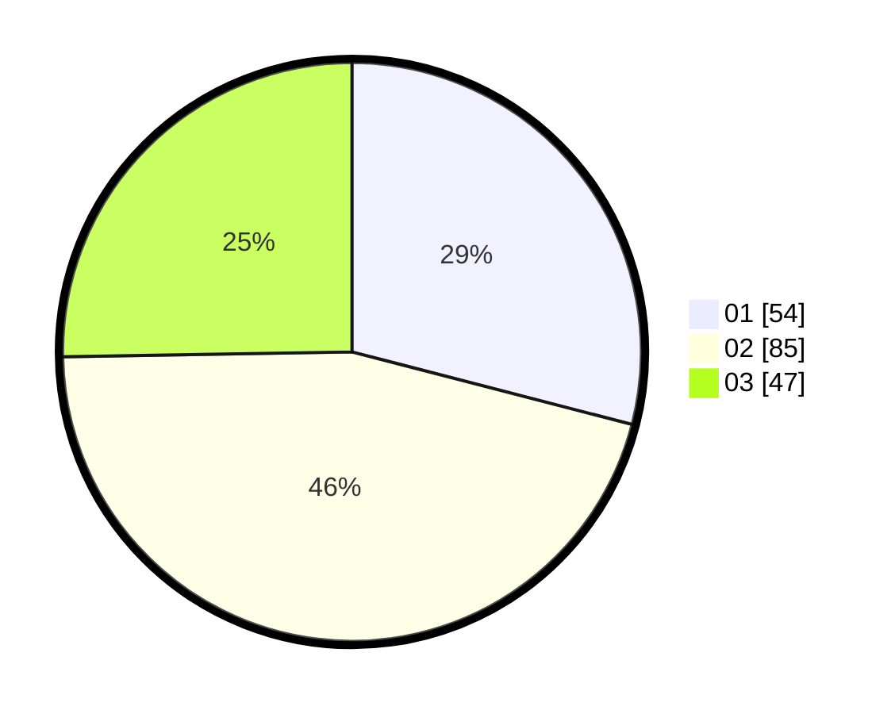

# Hasil

Hasil perolehan suara paslon dapat dilihat pada file paslon-01.txt, paslon-02.txt, dan paslon-03.txt.

Jika tidak ada, artinya data tersebut belum ada pada SIREKAP.

## Perolehan Suara

 * Paslon 01: **54**.
 * Paslon 02: **85**.
 * Paslon 03: **47**.

## Foto C Plano

https://sirekap-obj-formc.kpu.go.id/b3cf/pemilu/ppwp/31/72/05/10/02/3172051002019-20240214-155709--d699f1b3-1fc7-431f-a420-b18815fa1967.jpg

https://sirekap-obj-formc.kpu.go.id/b3cf/pemilu/ppwp/31/72/05/10/02/3172051002019-20240214-184521--514543ef-16b5-4f0c-b01f-2d541a0ce7f7.jpg

https://sirekap-obj-formc.kpu.go.id/b3cf/pemilu/ppwp/31/72/05/10/02/3172051002019-20240214-184720--b3b2963b-c77e-4dea-b362-1c2b84018609.jpg

## DATA PEMILIH TETAP

Jumlah pemilih dalam DPT: **261**.
 * L: **129**.
 * P: **132**.

## DATA PENGGUNA HAK PILIH

Jumlah pengguna hak pilih dalam DPT: **188**.
 * L: **92**.
 * P: **96**.

Jumlah pengguna hak pilih dalam DPTb: **0**.
 * L: **0**.
 * P: **0**.

Jumlah pengguna hak pilih dalam DPK: **0**.
 * L: **0**.
 * P: **0**.

Jumlah pengguna hak pilih: **188**.
 * L: **92**.
 * P: **96**.

## JUMLAH SUARA SAH DAN TIDAK SAH

JUMLAH SELURUH SUARA SAH: **186**.

JUMLAH SUARA TIDAK SAH: **2**.

JUMLAH SELURUH SUARA SAH DAN SUARA TIDAK SAH: **188**.
