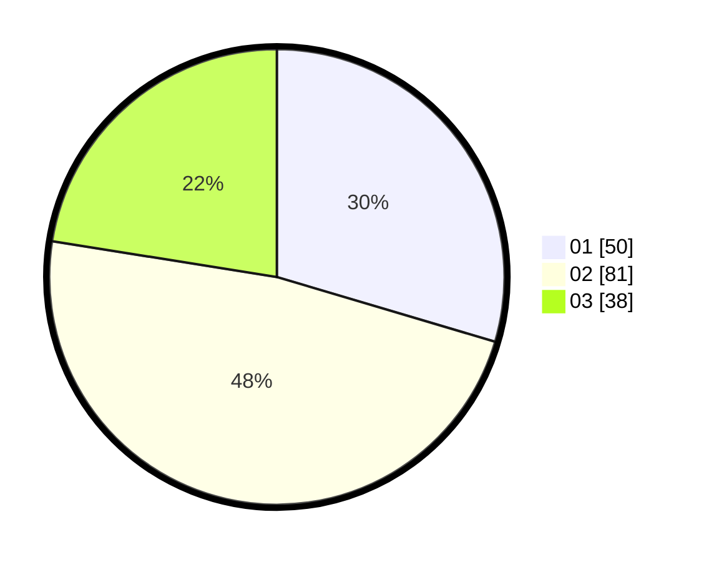

# Hasil

Hasil perolehan suara paslon dapat dilihat pada file paslon-01.txt, paslon-02.txt, dan paslon-03.txt.

Jika tidak ada, artinya data tersebut belum ada pada SIREKAP.

## Perolehan Suara

 * Paslon 01: **50**.
 * Paslon 02: **81**.
 * Paslon 03: **38**.

## Foto C Plano

https://sirekap-obj-formc.kpu.go.id/1b9b/pemilu/ppwp/31/72/05/10/02/3172051002022-20240214-155612--2a9b427f-0b65-488d-815b-47b6e846de14.jpg

https://sirekap-obj-formc.kpu.go.id/1b9b/pemilu/ppwp/31/72/05/10/02/3172051002022-20240214-155802--3f1602c3-8334-4795-974e-6d5851c7c9fe.jpg

https://sirekap-obj-formc.kpu.go.id/1b9b/pemilu/ppwp/31/72/05/10/02/3172051002022-20240214-160102--21af9838-90dc-46d9-8f19-52499bfd001e.jpg

## DATA PEMILIH TETAP

Jumlah pemilih dalam DPT: **224**.
 * L: **114**.
 * P: **110**.

## DATA PENGGUNA HAK PILIH

Jumlah pengguna hak pilih dalam DPT: **167**.
 * L: **80**.
 * P: **87**.

Jumlah pengguna hak pilih dalam DPTb: **2**.
 * L: **1**.
 * P: **1**.

Jumlah pengguna hak pilih dalam DPK: **2**.
 * L: **1**.
 * P: **1**.

Jumlah pengguna hak pilih: **171**.
 * L: **82**.
 * P: **89**.

## JUMLAH SUARA SAH DAN TIDAK SAH

JUMLAH SELURUH SUARA SAH: **169**.

JUMLAH SUARA TIDAK SAH: **2**.

JUMLAH SELURUH SUARA SAH DAN SUARA TIDAK SAH: **171**.
