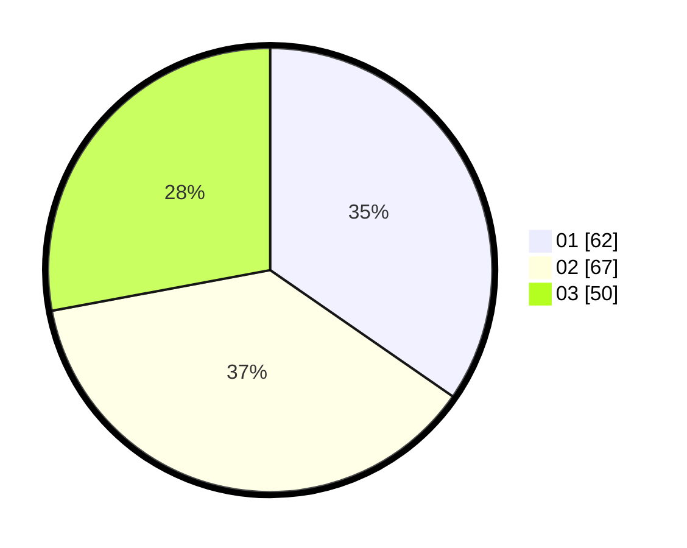

# Hasil

Hasil perolehan suara paslon dapat dilihat pada file paslon-01.txt, paslon-02.txt, dan paslon-03.txt.

Jika tidak ada, artinya data tersebut belum ada pada SIREKAP.

## Perolehan Suara

 * Paslon 01: **62**.
 * Paslon 02: **67**.
 * Paslon 03: **50**.

## Foto C Plano

https://sirekap-obj-formc.kpu.go.id/c7bc/pemilu/ppwp/31/72/05/10/02/3172051002046-20240214-190024--58f9b893-84a0-4b6b-bda9-1cb515777abd.jpg

https://sirekap-obj-formc.kpu.go.id/c7bc/pemilu/ppwp/31/72/05/10/02/3172051002046-20240214-190134--26bed78c-afe9-4702-8fd5-36d7e02d21bf.jpg

https://sirekap-obj-formc.kpu.go.id/c7bc/pemilu/ppwp/31/72/05/10/02/3172051002046-20240214-184722--10b3f125-2129-4026-90d2-97f1d449392a.jpg

## DATA PEMILIH TETAP

Jumlah pemilih dalam DPT: **239**.
 * L: **125**.
 * P: **114**.

## DATA PENGGUNA HAK PILIH

Jumlah pengguna hak pilih dalam DPT: **181**.
 * L: **91**.
 * P: **90**.

Jumlah pengguna hak pilih dalam DPTb: **0**.
 * L: **0**.
 * P: **0**.

Jumlah pengguna hak pilih dalam DPK: **1**.
 * L: **1**.
 * P: **0**.

Jumlah pengguna hak pilih: **182**.
 * L: **92**.
 * P: **90**.

## JUMLAH SUARA SAH DAN TIDAK SAH

JUMLAH SELURUH SUARA SAH: **179**.

JUMLAH SUARA TIDAK SAH: **3**.

JUMLAH SELURUH SUARA SAH DAN SUARA TIDAK SAH: **182**.
