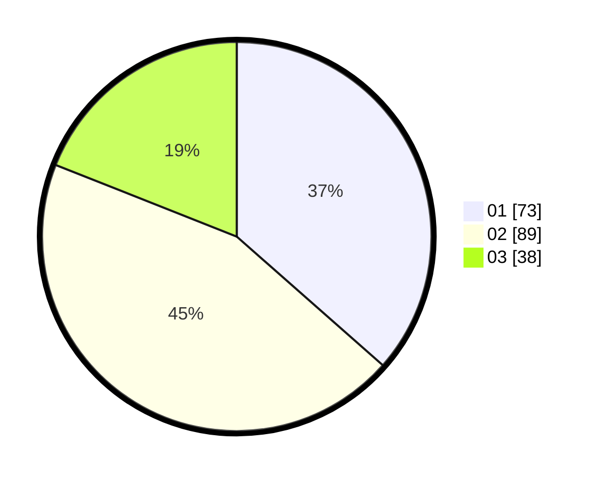

# Hasil

Hasil perolehan suara paslon dapat dilihat pada file paslon-01.txt, paslon-02.txt, dan paslon-03.txt.

Jika tidak ada, artinya data tersebut belum ada pada SIREKAP.

## Perolehan Suara

 * Paslon 01: **73**.
 * Paslon 02: **89**.
 * Paslon 03: **38**.

## Foto C Plano

https://sirekap-obj-formc.kpu.go.id/8bd4/pemilu/ppwp/31/72/05/10/02/3172051002066-20240216-152715--9ab91163-0217-4795-87ea-908144bf540d.jpg

https://sirekap-obj-formc.kpu.go.id/8bd4/pemilu/ppwp/31/72/05/10/02/3172051002066-20240215-222745--9432d7d3-b90c-4ca0-9bd8-dfb32ac1425f.jpg

https://sirekap-obj-formc.kpu.go.id/8bd4/pemilu/ppwp/31/72/05/10/02/3172051002066-20240215-223311--d6b26fff-1e9c-4d89-a577-88e82098b6de.jpg

## DATA PEMILIH TETAP

Jumlah pemilih dalam DPT: **288**.
 * L: **152**.
 * P: **136**.

## DATA PENGGUNA HAK PILIH

Jumlah pengguna hak pilih dalam DPT: **202**.
 * L: **104**.
 * P: **98**.

Jumlah pengguna hak pilih dalam DPTb: **2**.
 * L: **1**.
 * P: **1**.

Jumlah pengguna hak pilih dalam DPK: **0**.
 * L: **0**.
 * P: **0**.

Jumlah pengguna hak pilih: **204**.
 * L: **105**.
 * P: **99**.

## JUMLAH SUARA SAH DAN TIDAK SAH

JUMLAH SELURUH SUARA SAH: **200**.

JUMLAH SUARA TIDAK SAH: **4**.

JUMLAH SELURUH SUARA SAH DAN SUARA TIDAK SAH: **204**.
